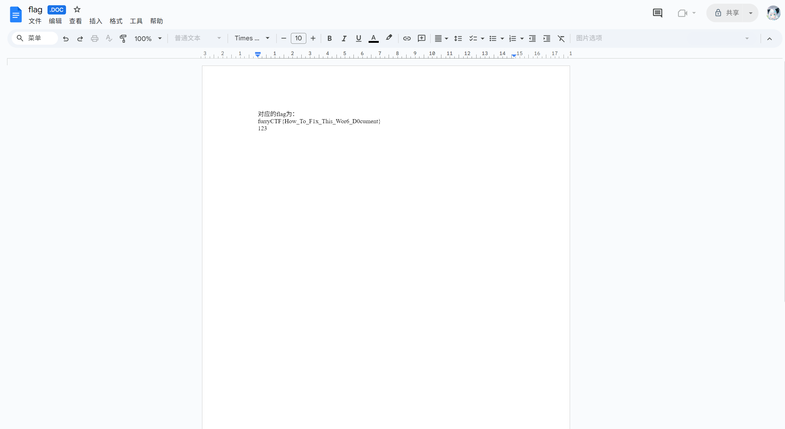
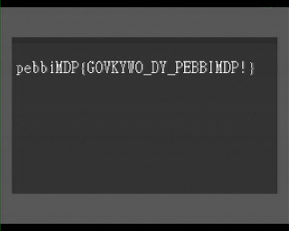
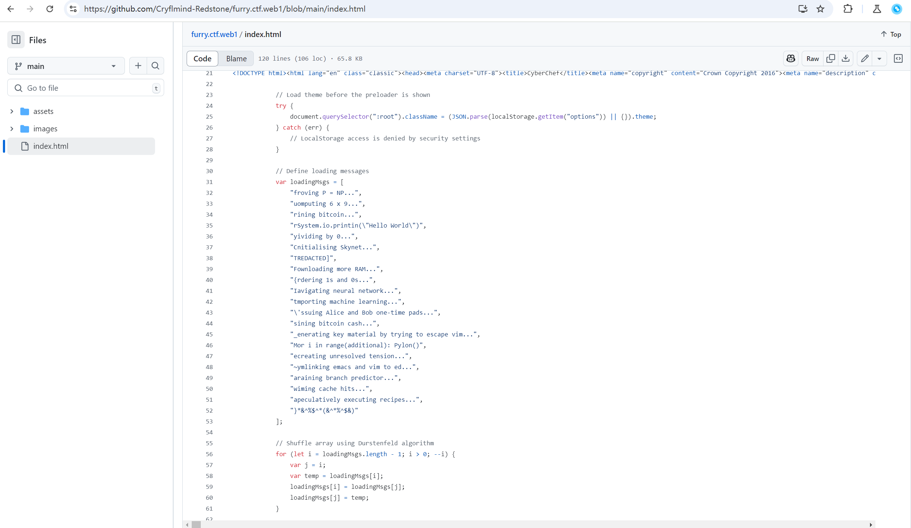

> **注意：**
>
> 此文章为完全没打过 CTF 的新人初次尝试 CTF 的记录和感想，这不是一篇好的题解，各位 CTF 大神们不要喷我 awa

> **另请参阅：**
>
> [furryCTF 2024 寒假赛题目](https://hydro.ac/contest/6728fe9aa325b9e5ba5f9489)
>
> 本人得分为 1886.5，位次 21（Hydro 排行榜），不得不说比我想象的好太多了。
>
> [furryCTF 2024 寒假赛官方/非官方题解](https://github.com/Cryflmind-Redstone/furryCTF-WP/tree/main)

## 个人感想

这个比赛是我没事逛 Hydro 看到的，觉得有意思就干脆点了个报名。后续到了年末想起来：哎，我是不是在 Hydro 上点了个比赛？于是就着手搞起来了。可惜我这个学校放假晚（实际 1 月 11 日考完），那段时间还在期末复习，没有办法全身心投入，只能看兴趣随意做做。

结果上来讲……我可能真有打 CTF 的天赋？我本身是写 Python 爬虫和机器学习的，但是在完全没有提示的情况下（我是在比赛后才加的交流群！），除了 Web，Crypto 和那些逆向没办法搞之外，Misc 和 OSINT 解了还蛮多的，鉴定为奇怪的知识懂得还挺多吧（

CTF 还是很好玩的，下次有机会再来玩玩……只要不太硬核。

## 部分题解

### [A. [beginner]签到题](https://hydro.ac/p/furryCTF024?tid=6728fe9aa325b9e5ba5f9489)

用一下网易云听歌识曲就行。是**彩虹楼**，出自造梦西游 3。

```text
furryCTF{zaomengxiyou3}
```

### [D. [misc]丢失的文档](https://hydro.ac/p/furryCTF015?tid=6728fe9aa325b9e5ba5f9489)

搜了一下如何将 .asd 文件转为 Word 文档，微软论坛里给出了直接重命名的方法。但是不知道是不是我 Office 365 的问题，在修改后缀名之后 Word 仍识别到是恢复文件。最终想了一个阴间的方法：扔到 Google Docs 上。



```text
furryCTF{How_To_F1x_This_Wor6_D0cument}
```

### [E. [misc]黑暗](https://hydro.ac/p/furryCTF035?tid=6728fe9aa325b9e5ba5f9489)

题目给了 8 张黑色 PNG 图，算了下 Hash 各不相同，扔到 Hex Editor 里面看了下几个文件的区别，发现尾部有玄机。

按顺序提取文件尾部多余的字节可以得到下方字符串：

```text
ZnVycnlDVEZ7SGVsbG9fSUVORF9Bd0F9
```

Base64 解码即可。

```text
furryCTF{Hello_IEND_AwA}
```

### [G. [misc]震耳欲聋](https://hydro.ac/p/furryCTF055?tid=6728fe9aa325b9e5ba5f9489)

这题很意外的让我秒了。因为之前听过 [Oscillofun](https://www.bilibili.com/video/BV12s411o74R/)，听到这个音频左右声道严重不对称当即想到应该是这种示波器音频（莉萨如图形）。正好电脑里装着上古的 GoldWave 自带 XY 图像模式，于是就解掉了。


```text
furryCTF{BADAPPLE}
```

### [M. [misc]此时无声胜有声](https://hydro.ac/p/furryCTF063?tid=6728fe9aa325b9e5ba5f9489)

网上随便找一个 Midi preview 就可以看到了。


```text
furryCTF{B1ack_Pi2no}
```

### [R. [misc]图片的秘密](https://hydro.ac/p/furryCTF028?tid=6728fe9aa325b9e5ba5f9489)

听出来了这是 Robot36 音频。在 Google Play 上有个[解码器](https://play.google.com/store/apps/details?id=xdsopl.robot36)，让手机录进去就行。



然后是个 Ceasar Cipher。*话说，flag 是拼错了吗？提交时还犹豫了一下这个 WELAOME 是不是 WELCOME……*

```text
furryCTF{WELAOME_TO_FURRYCTF!}
```

### [X. [web]史莱姆的世界](https://hydro.ac/p/furryCTF045?tid=6728fe9aa325b9e5ba5f9489)

既然是在阿尔法营的作品，那我便直接打开来看吧。~~为此还注册了个阿尔法营的账号，我以前一直在 Scratch 官网上玩的说。~~

找了一圈，flag 就藏在高玩榜的角色造型里面。以及这个 flag 是反过来写的。


```text
furryCTF{The_Wyrms1ayer_0f_Ender_Drag0n}
```

### [d. [rev]烦人的黑框框](https://hydro.ac/p/furryCTF046?tid=6728fe9aa325b9e5ba5f9489)

***[非预期解，纯菜鸡解法] 我的解法非常阴间和暴力。请不要学我这道题目的解法。***

咱说过，咱就是个写爬虫的，虽然都是 Python，但是我用 VSCode，没有反编译器，用 `pyinstxtractor.py` 提取出来 .pyc 也看不了。咋办嘞？硬着头皮上！

既然是个病毒，那不妨扔到 [VirusTotal](https://www.virustotal.com/gui/file/97bea3755df567d957f67ebb21e2dc26a78e371f403498a4b4c001d65d314a0a/behavior) 上看看你的行为（是的，这文件咱第一个上传的），结果发现它在 `localhost:56387` 上搞小动作。


既然有一个 `data` 字段，甚至有个 `data==` 的请求，那么我估计这程序就是把 flag 通过 BaseXX 的形式一个字符一个字符的发到 56387 端口上。

在 VirusTotal 上确认这个 Trojan 似乎没有有害行为之后，咱直接在实体机上跑了这个玩意（***高危操作！！！***）。逆向我不会，监听个端口我还不会吗？

```python
import socket

server_socket = socket.socket(socket.AF_INET, socket.SOCK_STREAM)
server_socket.bind(('127.0.0.1', 56387))
server_socket.listen(1)

while True:
    client_socket, _ = server_socket.accept()
    
    # Receive data from client
    data = client_socket.recv(4096).decode('utf-8')
    
    # Extract the data parameter from the request
    if 'data=' in data:
        # Find the start of the data parameter
        start = data.find('data=') + 5
        # Find the end of the data parameter (either space or end of string)
        end = data.find(' ', start)
        if end == -1:
            end = len(data)
        # Extract and print the data
        data_param = data[start:end]
        print(data_param, end="")
    
    client_socket.close()
```

忍受着黑框框，我暴力的抓到了 Base32 加密的 flag。（重启电脑次数 +2）

```text
MZ2XE4TZINKEM62ON52GKX2UNBSV6QRTGJPUGMDEMV6Q====
```

```text
furryCTF{Note_The_B32_C0de}
```

### [g. [crypto]Scratch](https://hydro.ac/p/furryCTF017?tid=6728fe9aa325b9e5ba5f9489)

*话说出题人是真喜欢出 Scratch 的题目啊……*

下载下来是一个 JSON。JSON 文件直接改后缀为 `.sb3` 就能被 Scratch 解析，将这个文件扔到 Scratch 官网上：


播放了一堆音符，将音符数字转换为 ASCII text 就行。~~Life is PIANO?~~

```text
furryCTF{Life_1s_Sing1ng}
```

### [h. [crypto]MD5](https://hydro.ac/p/furryCTF043?tid=6728fe9aa325b9e5ba5f9489)

暴力破 MD5！hashcat 是啥不认识，但 Python 咱会写。

```python
import hashlib
import itertools

# 给定的 MD5 哈希值
md5_hashes = [
    "45c21d962131b80744fe6486cd24fd0c",
    "8fb395ce2928cbff098b2155f7eefef7",
    "fba373ec33f112d6fc74651cedc0c6c0",
    "639849f6b368019778991b32434354fc"
]

# 生成所有 5 到 7 位小写字母组合
def generate_combinations():
    chars = 'abcdefghijklmnopqrstuvwxyz'
    for length in range(5, 8):  # 5 到 7 位
        for combo in itertools.product(chars, repeat=length):
            yield ''.join(combo)

# 破解 MD5
def crack_md5():
    results = {}
    for combo in generate_combinations():
        md5_hash = hashlib.md5(combo.encode()).hexdigest()
        if md5_hash in md5_hashes:
            results[md5_hash] = combo
            print(f"Found: {combo} -> {md5_hash}")
            if len(results) == len(md5_hashes):
                break
    return results

# 运行破解
results = crack_md5()

# 输出结果
flag = "furryCTF{" + "_".join(results[md5] for md5 in md5_hashes) + "}"
print("Flag:", flag)

'''
Found: again -> 639849f6b368019778991b32434354fc
Found: furbbs -> 8fb395ce2928cbff098b2155f7eefef7
Found: seeyou -> fba373ec33f112d6fc74651cedc0c6c0
Found: furlary -> 45c21d962131b80744fe6486cd24fd0c
Flag: furryCTF{furlary_furbbs_seeyou_again}
'''
```

```text
furryCTF{furlary_furbbs_seeyou_again}
```

### [l. [hardware]Charge](https://hydro.ac/p/furryCTF031?tid=6728fe9aa325b9e5ba5f9489)

用淘宝识图看了下商品，一下子就搜到了一模一样的。中间的 50% 没找到答案，但是爆破出来了。

*这玩意不放到 OSINT 里面？*

```text
furryCTF{20000_50_PPJL65C}
```

### [o. [osint]人文风景](https://hydro.ac/p/furryCTF020?tid=6728fe9aa325b9e5ba5f9489)

查了一下对面店铺的手机号码归属地，大部分是安徽省阜阳市的。在这个区域搜索了正对面的“顺风车棚”居然搜到了（高德地图限定，百度搜不到，就因为这个还被卡了不久）。


```text
furryCTF{laoliuchuantongzhengcaiguan}
```

### [p. [osint]循迹](https://hydro.ac/p/furryCTF021?tid=6728fe9aa325b9e5ba5f9489)

注意到图一牌子上有个即墨古城，搜了一下位于山东省青岛市即墨区。在这个附近搜了火锅店（百度地图），对比一下图二锅的形状，第一家就是答案。

以及，图一应该是古城南边的墨小牛。

```text
furryCTF{dezhuanghuoguo}
```

### [q. [osint]神秘影片](https://hydro.ac/p/furryCTF023?tid=6728fe9aa325b9e5ba5f9489)

这题卡了我不少时间。拿网易云听歌识曲识别出来[这个](https://music.163.com/#/song?id=1881821029)，于是就到 bilibili 搜这首歌，什么也没有得到。后来看云音乐的评论区才意识到这玩意是个无授权的二创填词曲！被引到了正道上，找到 WUHAN 这首歌。之后从一个[疑似搬运视频](https://www.bilibili.com/video/BV1TU4y1J7bq)的推荐以及后面的 ky 评论引到了 Hyun's Dojo 频道上，从片头的动静确认了是这位 UP 的视频。一个一个看有没有时长=2 分 55 秒 ± 1 秒的视频，看到了[这个视频](https://www.bilibili.com/video/BV1Bf4y157pa)。

*话说我其实是 Hyun's Dojo 老粉来着，YouTube 关注了他的频道，但却没听出来他片头……他的 Doors 系列可算是太经典了，什么时候去回味一下吧。*

```
furryCTF{BV1Bf4y157pa}
```

### [u. [osint]旅行照片](https://hydro.ac/p/furryCTF052?tid=6728fe9aa325b9e5ba5f9489)

随便找个识图，日月双塔，秒了。~~这就 150 分了？~~

```text
furryCTF{riyueshuangta}
```

### [v. [osint]时光机](https://hydro.ac/p/furryCTF032?tid=6728fe9aa325b9e5ba5f9489)

你怎么知道我也是核邪铀碍五人组的粉丝？

一眼 [BadCen](https://space.bilibili.com/14890801)，然后去看他 2017-04-16 之后的 bilibili 视频就能找到了。

*可惜这个五人组现在也很少一起出现了……*

```text
furryCTF{DiaMondIly}
```

### [w. [osint]归去](https://hydro.ac/p/furryCTF057?tid=6728fe9aa325b9e5ba5f9489)

其实不难发现这是界首南站。露出来了。似乎写题解的还没有人发现？


然后直接去 12306 查界首南站的大屏信息，在一楼候车室 G2805 次之前的一趟车就是答案。

```text
furryCTF{shanghaizhan}
```

## 彩蛋？

来自题目 [W. [web]雪花飘飘](https://hydro.ac/p/furryCTF025?tid=6728fe9aa325b9e5ba5f9489)：题目作者是用 GitHub Pages 布置题目的。于是去 [Cryflmind-Redstone 的 GitHub](https://github.com/Cryflmind-Redstone/furry.ctf.web1/blob/main/index.html) 看了一眼发现了这个。



不难发现 `loadingMsgs` 里面藏着一个 flag：

```
furryCTF{It's_Me~awa}
```

也许是废题？也许是彩蛋？谁知道呢？总之写在这里吧。

可惜，题目没解出来。
