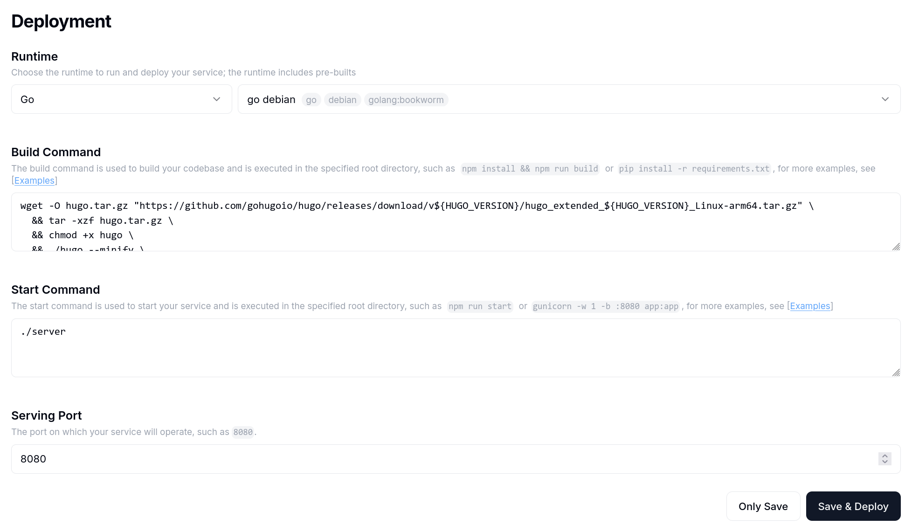

大概 3 个月前，一个新的 PaaS 平台 Leapcell 上线了。他们和主流的 PaaS 不一样，主要聚焦在了 FastAPI、Django 等知名 Python 服务上，对 Golang、Rust 和 TypeScript 也有很棒的支持。而我的个人项目正好是 FastAPI 写的，因此就探索了这个平台，把服务尝试部署在了这上面，确实很好用。后来发现，这个平台比想象中的强大，甚至可以部署这个博客（Hugo 框架，刚好是基于 Go 的），因此写一篇文章记录一下。

## 准备工作

Leapcell 目前只支持 GitHub 项目，需要 GitHub 账号方可注册，因此请将你的项目上传到 GitHub 再继续。涉及隐私的，一定要记得上传至私有仓库。每位免费版用户可以部署 20 个服务，并可以分配到最高 3 vCPU，4096 MiB RAM 的资源。

目前 Leapcell 支持以下技术：


细心的朋友可以发现，它支持 Astro 博客框架。喜欢用 Astro 的朋友又多了一个新的选择（很可能是为数不多的无服务器部署 Astro 方案！）。此外，一些很有名的前端，比如 Next.js、Nuxt.js 也是支持的。

现在官方提供两个部署区域，N. Virginia, US East 和 Tokyo, Japan，用的都是 AWS。为大家测试了一下，用的是我的博客，选择了 Tokyo 作为部署区域，在中国大陆整体的可访问性和速度还是不错的，阻断情况比较少，也许是一个不错的“曲线救国”方案，推荐大家去试试看。


## 部署

其实这次的方法有些讨巧。作为一个非静态的 PaaS，部署一个静态博客确实有些尴尬，因此我实际上是通过一个简单的服务器实现的：

```go
package main

import (
    "log"
    "net/http"
    "os"
)

func main() {
    port := os.Getenv("PORT")
    if port == "" {
        port = "8080"
	}

    // Serve static files from the public directory
    fs := http.FileServer(http.Dir("./public"))
    http.Handle("/", fs)
    
    log.Printf("Server starting on port %s", port)
    log.Fatal(http.ListenAndServe(":"+port, nil))
}
```

请在你的仓库根目录下创建 `main.go`，然后填入上述内容。

注册好账号后，在 Service List 中选择 Create Service，然后连接到你的仓库。


在下图的配置页面中，选择 Runtime 为 `go debian`，Build Command 为下方内容（其实就是下载并解压 Hugo，然后生成并 build 一个服务器出来），Start Command 填入 `./server`，其余不需要动。



```shell
wget -O hugo.tar.gz "https://github.com/gohugoio/hugo/releases/download/v${HUGO_VERSION}/hugo_extended_${HUGO_VERSION}_Linux-arm64.tar.gz" \
  && tar -xzf hugo.tar.gz \
  && chmod +x hugo \
  && ./hugo --minify \
  && go build -o server main.go
```

在 Environment Variables 中存放一个 HUGO_VERSION 变量，用于指定 Hugo 版本。


这样应该就可以部署了。如果你是中国大陆的用户，记得调整部署区域至 Tokyo, Japan 以获得更高的访问速度（有些设置在更换后会默认把部署区域换回 US East，还请注意）。你还可以根据你的需要调整 RAM，下方的 vCPU 会根据你选择的 RAM 自动调整。

## 绑定域名

在部署好的服务中选择 Add Domain/Path：


此处你可以选择使用 Leapcell 域名或是自定义域名。使用自定义域名，需要你添加一条 A 记录。注意，目前只支持最高三级域名。同时，选择的区域（Region）必须和你服务部署的区域一致，否则会报错。


下面的 Route Rules 方便你创建 API 路径，通向不同的服务，是非常方便的功能。示意图如下：


至此你的博客应该可以正常访问了，而且速度还算不错！

## 写在后面

实际上我认为 Astro 才是更合适的部署场景，使用这个平台部署 Hugo 这种玩意确实有点小题大做了。不知有没有人想尝试一下 Astro 部署，如果可以的话请告诉我感想！

总之平台的使用体验很流畅，之前我的 FastAPI 服务一直是拿的 Azure 免费送的 1 Core/1 GiB 的小机子部署的，操作起来非常不爽，有了这个之后改善了许多。它的分析也比直接抓服务器 log 方便很多：


它的启动优化的很快，会在请求的一瞬间把服务拉起来（宣传说冷启动时间小于 250 ms），你可以看到 log 中服务被起了好多次；还会根据请求数量动态把服务的实例数量拉高。因此它的计费方式也很智能，按照真正服务被访问的时间计费，是很创新的设计。当然，如果你的服务访问人数多了，你也可以升级到持久部署，按照传统方式持续计费。


所以如果你刚好有适合的服务，请务必试一试这个，应该能帮到你！