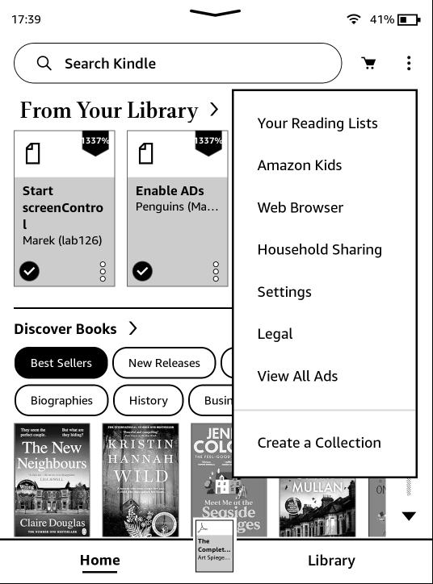
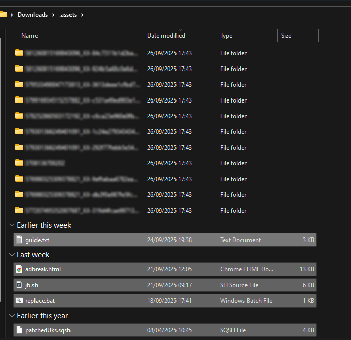

> 本文档是：[Kindle 越狱](/p/kindle-jailbreak) 的补充。你很可能需要其中的一些知识。
>
> 本文依旧参考 Kindle Modding Wiki 编写。

AdBreak 是在 WinterBreak 失效后，利用 [CVE-2012-3748](https://scarybeastsecurity.blogspot.com/2017/05/ode-to-use-after-free-one-vulnerable.html) 的最新越狱法，于今年 9 月 25 日发布。

此方法适用于 Kindle 固件 5.18.1 及以上版本。注意：该漏洞可能在版本 5.18.5.0.1 后修复。如果你的设备拥有此版本的固件，请谨慎操作，因为不一定能成功。**已经确认固件版本 5.18.6 修复了 AdBreak，因此请不要更新该版本固件。**

[破解的准备工作](/p/kindle-jailbreak/#越狱前准备)同 WinterBreak，但需要你的 Kindle 能**正确显示广告**。如果你的 Kindle 还没有注册，请先阅读[阻止自动更新](/p/kindle-jailbreak/#附加阻止自动更新)步骤。

## 越狱步骤

1. 下载最新的 [AdBreak Release](https://github.com/htimesnine/AdBreak/releases/download/v1.0.1/adbreak.zip)；
2. 让你的 Kindle 下载广告。连接网络并等一会。如果在锁屏界面，Kindle 显示了广告，你可以继续越狱；
3. 打开飞行模式；
4. 主界面点击右上角菜单，选择“查看所有广告”/"View All Ads"；
   
5. 将 Kindle 连接到电脑，打开 system 文件夹并复制 .assets 到电脑中；
   
6. 解压先前下载的 AdBreak 并将所有内容放在复制好的 .assets 文件夹中；
   
7. 双击 `replace.bat` 运行之。对于 macOS/Linux，在终端执行 `find . -name 'details.html' -exec cp adbreak.html {} \;`；
8. 删除 Kindle 中原本的 .assets 文件夹并将电脑中处理好的 .assets 文件夹放回 Kindle；
9. 断开 Kindle 与电脑的连接。随意点击一个广告并确认弹窗。当你点击弹窗 "Bang!" 的 "Close" 按钮时，越狱脚本将运行。你可以安全忽略任何的“应用错误”弹窗。   
   

恭喜你！你的 Kindle 已经越狱！接下来请回到原来的文章去进行越狱后工作吧！

需要注意的是，由于越狱方法的更新，你在安装最新版本 Hotfix 时可能失败。如果遇到这种情况，请安装[兼容版本](https://github.com/KindleModding/Hotfix/releases/download/v2.2.1/Update_hotfix_universal.bin)。

## 常见问题

### 操作失败

- 找不到 system 文件夹？
  - 有可能被系统隐藏了。请手动输入路径访问或者在文件夹设置里开启显示隐藏文件和文件夹。
- "Bang!" 显示但是越狱脚本不运行？
  - "jb.sh" 和 "patchedUks.sqsh" 必须在 Kindle 的 .assets 文件夹里。检查一下是否有缺。
 
### 我的 Kindle 没有广告

- **Kindle Scribe 和 Colorsoft 不会工作**。这俩都是新出的，你不会真买到了吧？
- 尝试[转区](/p/kindle-jailbreak/#转区)。建议使用以下区域之一：US, UK, DE, FR, IT, ES, JP, AU。请使用尽量真实的信息。
- 尝试为你的 Kindle 账户添加付款信息。信息尽量和你所选区吻合。
- 在 Amazon 账户设定中，开启 "Special Offers for your Kindle" 或类似选项。
- 同步你的 Kindle。总归会有广告出来的。

小提示：Kindle Modding Community 还有两个破解方法未发布，敬请期待！这边也会简单翻译和总结，祝各位玩得开心！