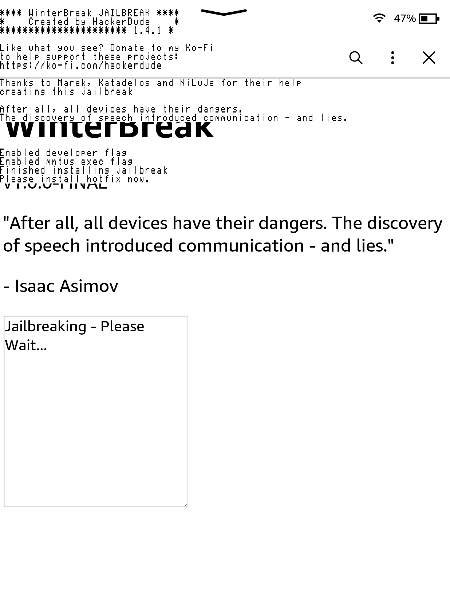

> 本文章参考以下来源：
>
> * [It's Time to Jailbreak Your Kindle. - YouTube](https://www.youtube.com/watch?v=Qtk7ERwlIAk)
> * [Kindle Modding Wiki](https://kindlemodding.org/)
> * [KOReader User Guide](https://koreader.rocks/user_guide/)
> * [2025 Kindle 越狱教程：适用于版本低于 5.18.1 的固件](https://bookfere.com/post/1145.html)
>
> 如果有条件的话，请务必去看看原文！

距离 Kindle 中国关闭（2023 年 6 月 30 日）已经过去快两年了。这段时间以来，我的 Kindle 一直在我的抽屉里躺着，扮演着泡面盖板的角色。我曾尝试一些第三方的 Kindle 刷机包，奈何门槛和风险都很高。直到今年初，某位大神看不惯亚马逊的吃相，在 2025 年新年发布了 WinterBreak 破解，让 Kindle 越狱变得触手可得。本文将详细介绍这种越狱方法，祝你也能越狱成功。

## 前言：这合法吗？

自然。你购买了这个设备，你理所应当地拥有对这个设备的处置权。亚马逊可能会因此将你封号（毕竟你确实违反了 Kindle 的用户协议），但是越狱后你完全不需要依赖亚马逊服务。

事实上，亚马逊的吃相不是很好看。文前提到的视频中有说，亚马逊占有美国电子书销售额的约 80%，他们对自己电子书市场做的某些决定会影响到很大部分的电子书读者。他们卖给你的只是这本书的**不限期的租赁许可**。一旦你的亚马逊账户因为某些原因被封禁，如果你没有在本地备份电子书的习惯，你的电子书也会一齐消失，**这些书从来都不是你的**。而且亚马逊的账户申诉很困难，因为**它不会告诉你封禁原因**，你都不知道从哪里开始申诉。自今年 2 月 26 日起，亚马逊不再提供电子书源文件下载到电脑的功能。你只能从阅读器通过 Wi-Fi 下载，很明显，亚马逊不希望你备份电子书，或者直接移除里面的 DRM 加密。

以及你还要花至少 $10 去掉锁屏广告。拜托哎，我买了这个设备就是给你封面放广告的？

## 越狱前准备

> **越狱有风险，玩机须谨慎。**
>
> 本文不对因为不当操作而变砖的设备负责！

请使用[这个链接](https://kindlemodding.org/jailbreaking/kindle-models)确认你的 Kindle 型号。

在你的 Kindle 主页上点击**右上角菜单 - 设置 - 设备选项 - 设备信息**查看设备的**序列号**。在上方的网页中键入序列号（只需要前 8 位就足够了）查询。如果查询到 Recommended Jailbreak 显示为 WinterBreak（如下图）则表明你可以使用本文中介绍的方法。否则请自行阅读对应的破解方法。


WinterBreak 需要你连接到亚马逊商店，因此如果你的账号在中国大陆区域，你必须**转区**后破解。当你使用中国大陆的账号登入 Kindle 时，Kindle 不会显示商店菜单。

### 转区

> 请参照以下文章进行转区，这里只做简述。
>
> [Kindle 退出中国后如何继续购买电子书及使用推送服务](https://bookfere.com/post/985.html)

首先从**右上角菜单 - 设置 - 我的账户 - 注销设备**退出当前账户。**此操作会清空你购买的电子书，若你的账户在中国大陆区域且还没有备份这些内容，你将永久失去他们！三思而后行！**

重启设备后按照主界面引导注册账号，随便选择其他区域即可。**请使用没有注册过亚马逊账号的邮箱和手机号码操作**。如果你没有这些，你可以[注销你的账号](https://www.amazon.com/privacy/data-deletion)后再重新注册。

全程不需要魔法上网，也不需要国外手机号。很简单。

### 最后的检查

请确保你拥有以下条件：

* 你需要一台电脑和一根数据线来操作；
* 你的 Kindle 已注册（登录了账号）；
* 你的 Kindle 可以自动连接上一个可访问互联网的 Wi-Fi 网络。
* 在**右上角菜单 - 设置 - 设备选项 - 设备信息**查看设备的**内核版本**，需要低于 5.18.1。WinterBreak 暂时不支持该版本的内核。如果你已经处于该版本的内核，建议你[阻止自动更新](#附加阻止自动更新)，不要让它更新到更奇怪的版本了……
  
如果你因为设备固件版本不满足越狱条件，也请无须焦虑，开发者们已经研究出了新的越狱方法，适用于 5.18.1+ 固件，但是该越狱方法利用了 Kindle 的重大安全漏洞，在正式发布前需要上报漏洞给亚马逊以防不法使用，因此很可能在破解发布时该漏洞已被修复。如果你希望等待该越狱法发布，请务必[阻止自动更新](#附加阻止自动更新)。

## WinterBreak

> 你也可以在[这篇文章](https://bookfere.com/post/1145.html)查看详细的图文教程。
>
> 为了保证你在破解时 Kindle 不会自动更新，建议你完成[阻止自动更新](#附加阻止自动更新)步骤。

开始越狱吧！

1. [从 GitHub 下载最新的 WinterBreak 发行版](https://github.com/KindleModding/WinterBreak/releases/latest/download/WinterBreak.tar.gz)；
2. 下拉状态栏，启用**飞行模式**；
3. 重启你的 Kindle；
4. 解压刚刚下载的 WinterBreak 包，在 Kindle 重启完后连接电脑，将所有内容（包括**隐藏文件**，特别是 `.active_content_sandbox` 文件夹）复制到 Kindle 根目录下。提示有同名文件时请直接覆盖；
5. 从电脑弹出你的 Kindle。点击 Kindle 主页右上角的**商店**标志打开商店。此时设备会询问你**是否关闭飞行模式**，点击**好的**关闭；
6. 当设备出现下图页面时，点击 WinterBreak 字样开始破解；
   
7. 等待一小会，屏幕上会出现 `Please install hotfix` 类似的字样。恭喜你已经越狱！如果没有看见这些文字，请检查飞行模式是否关闭。
   

此时，请**再打开飞行模式**，我们要开始越狱后的工作了。

## 越狱后工作

在此过程中请**保持飞行模式开启**，避免 Kindle 自动更新毁了你的越狱体验！

### 安装热补丁（Hotfix）

安装热补丁后，可以保证 Kindle 在更新后还能保持越狱状态。

1. [从 GitHub 下载最新的 Hotfix](https://github.com/KindleModding/Hotfix/releases/latest/download/Update_hotfix_universal.bin)；
2. 将 Kindle 连接电脑，将下载的 `Update_hotfix_universal.bin` 复制到 Kindle 根目录下。如果你的 Kindle 中含有其他 `.bin` 文件，你需要**删除他们**后 Hotfix 才可以正常工作；
3. 弹出你的 Kindle。点击**右上角菜单 - 设置 - 右上角菜单 - 更新 Kindle**，在弹出的提示中确认**更新**；
4. 耐心等待 Kindle 重启。重启过后，你应该可以从你的书架上看到一本名为 **Run Hotfix** 的书。点击它便可以启用热补丁。

**注意：该补丁需要在设备每次进行 OTA 更新后运行一次。**

安装完热补丁后，你可以接着安装 KUAL 软件启动器和 MRBI 软件包管理器。

### 安装 MRBI / KUAL

你需要安装 KUAL 软件启动器和 MRBI 软件包管理器以在 Kindle 上运行自定义 APP。

1. [下载 MRBI](https://fw.notmarek.com/khf/kual-mrinstaller-khf.tar.xz)；
2. 使用[此链接](https://kindlemodding.org/jailbreaking/post-jailbreak/installing-kual-mrpi/Update_KUALBooklet_ALLDEVICES_KS2_install.bin)下载 KUAL Coplate 如果你的 Kindle 比 K5 型号要新（在 2012 年之后发布的设备）；否则使用[此链接](https://storage.gra.cloud.ovh.net/v1/AUTH_2ac4bfee353948ec8ea7fd1710574097/mr-public/KUAL/KUAL-v2.7.35-g2d06358-20250103.tar.xz)下载 Legacy 版本；
3. 解压 KUAL 包，连接 Kindle 并将 `mrpackages` 和 `extensions` 文件夹复制到 Kindle 根目录中；
4. 解压 MRBI 包，找到 `Update_KUALBooklet_*_install.bin` 文件，并将其复制到 Kindle 的 `mrpackages` 目录中；
5. 弹出 Kindle，在搜索框中键入 `;log mrpi` 回车；
   
6. 等待 KUAL 安装。你会看到 Kindle 白屏并显示一些图标，之后会自动返回到主界面，此时你应该看到书架上多出一本名为 KUAL 的书。如果你看到**应用程序错误**的提示框，你可以安全地将其关闭，这是正常现象且不会有影响。

### 停止 OTA 更新

Kindle 在连接到网络时会自动更新。虽然有热补丁的存在，但难免会出问题使越狱状态失效。我们可以停止 OTA 更新，达到一劳永逸的效果。

开始之前，请务必通过**右上角菜单 - 设置 - 设备选项 - 设备信息**查看 Kindle 的**固件版本**。不同固件版本需要的操作不同。

如果你的固件版本**小于或等于 5.10.x**，请遵循以下操作：

1. 连接 Kindle；
2. 在 Kindle 根目录下建立名为 `update.bin.tmp.partial` 的文件夹，右键文件夹选择**属性**，选中**只读**后点击**确认**；
3. 弹出 Kindle。此时设备 OTA 更新已经被禁用。

如果你希望恢复 OTA 更新，删除 `update.bin.tmp.partial` 即可。

---

如果你的固件版本**大于 5.11.x**，请遵循以下操作：

1. [下载 renametotabin](https://www.mobileread.com/forums/attachment.php?attachmentid=184438&d=1609580931)；
2. 连接 Kindle；
3. 解压 renameotabin 并将其中 `renameotabin` 文件夹复制到 `extensions` 文件夹中。若无 `extensions` 文件夹，请手动创建之；
4. 弹出 Kindle；
5. 从书架上打开 KUAL，点击 **Rename OTA Binaries - Rename**。你的 Kindle 将重启。此时设备 OTA 更新已经被禁用。

如果你希望恢复 OTA 更新，请在 KUAL 中点击 **Rename OTA Binaries - Restore**。

此时你可以安全地关闭飞行模式了。

### 恢复亚马逊商店

**注意：停止 OTA 更新后才可进行下述操作！**

通常情况下你可以跳过这部分，但如果你出于某些原因仍然希望访问亚马逊商店，请遵循以下步骤：

1. 连接 Kindle；
2. 删除 Kindle 根目录下的 `.active_content_sandbox` 文件夹。该文件夹有可能是隐藏的；
3. 弹出 Kindle；
4. 按住 Kindle 电源键超过 20s，等待其完全重启。此过程耗时相对较长。此时你可以使用亚马逊商店。如果不行的话，尝试再次重启。

### 安装 KOReader

说了这么多了，我们还没安装一个阅读器呢。KOReader 是一个功能全面的阅读器，支持 EPUB, PDF, DjVu, XPS, CBT, CBZ, FB2, PDB, TXT, HTML, RTF, CHM, DOC, MOBI, ZIP 等格式的直接打开，以及各种个性化设定。应该比 Kindle 原生的要好用多了。

开始之前，请确认你正确安装了 MRBI 和 KUAL。

还记得之前的内核版本吗？请根据你的内核版本和设备型号，从[官方 Release 页面](https://github.com/koreader/koreader/releases)选择对应的发行版：

* `kindle-legacy`: K2, DX, K3 及其所有变种；
* `kindle`: K4, K5, PW1；
* `kindlepw2`: 其余更新的设备型号（PW2, KV, KT2, PW3, KOA, KT3, KOA2, PW4, KT4, KOA3, PW5, KS），且内核版本小于等于 5.16.2.1.1；
* `kindlehf`: **所有**内核版本大于等于 5.16.3 的设备。

对于内核版本大于等于 5.16.3 的设备，另外提供一种简易安装方式：在[此处](https://scriptlets.notmarek.com/)下载 KOReader Installer (nightly)，将其放在 Kindle 根目录下的 `documents` 文件夹中，并在书架中运行它，脚本将自动下载并为你安装 KOReader。

**注意：上述方法不一定有效。推荐你手动安装。**

下载完后，请遵循以下步骤：

1. 连接 Kindle；
2. 解压下载的包，并将 `extensions` 和 `koreader` 复制到 Kindle 根目录下，出现同名文件时请全部替换；
3. 弹出 Kindle，点击书架上的 KUAL，找到 **KOReader** 菜单并进入；
4. 选择一种方式进入 KOReader：
   * Start KOReader：正常启动 KOReader。
   * Start KOReader (no framework)：杀死 Kindle 原生 UI 并启动 KOReader，为 KOReader 提供更多内存。
   * Start KOReader (ASAP)：快速启动 KOReader，将跳过一些启动前检查。

恭喜！你可以开始下载电子书并开始读书了！

至此，你的破解后工作算做完了。如果你希望探索更多，你可以到[这里](https://scriptlets.notmarek.com/)看看更多的小脚本，或者去[官方 Discord](https://discord.com/invite/wDbbZTF5QF) 与大家交流！

### 附加：重置设备后恢复

如果你在越狱的状态下使用 OTABlocker 并重置了设备，你的设备很可能损坏。请执行以下步骤修复设备：

1. [安装 MRPI](#安装-mrbi--kual)；
2. 再执行一遍停止 OTA 的步骤；在最后一步时，选择 **Restore** 而不是 Rename。 

### 附加：阻止自动更新

> 本部分适用于**没有越狱的 Kindle**。如果你的 Kindle 已经越狱且完成了阻止更新的步骤，你可以忽略此部分。
>
> 如果你仍然满足越狱的条件，并且准备开始越狱，推荐你做这一步骤，防止越狱中途进行 OTA 更新，破坏你的越狱行动。

当系统中有空余储存空间时，Kindle 可能会在这些时候触发自动更新：
* 打开 Kindle 商店时；
* 在 Kindle 上登录亚马逊账户时；
* Kindle 连接了 Wi-Fi 网络，哪怕就一小会；
* Kindle 在连接了网络的情况下重启。

因此可以通过填满 Kindle 的存储空间来阻止更新（大概留 20~50 MB 空余即可）

你可以使用以下方式达到这一目的：
1. 打开飞行模式；
2. 连接 Kindle；
3. 下载 [Kindle-Filler-Disk](https://github.com/bastianmarin/Kindle-Filler-Disk/) 脚本（Windows 使用 `Filler.ps1`，macOS/Linux 使用 `Filler.sh`）；
4. 将脚本复制到 Kindle 根目录下；
5. 运行脚本，选择需要留下的空间（默认 20 MB）；
6. 弹出 Kindle。在**右上角菜单 - 设置 - 设备选项 - 设备信息**中确认剩余空间是否小于 20 MB；
7. 如果现在你还没有在 Kindle 上登录你的账号，你可以短暂关闭飞行模式并登录。你的设备应该不会自动更新。在此之后，请立即再次打开飞行模式。

**在任何时候，如果你发现 Kindle 根目录下出现 `.bin` 文件或者名为 `update.bin.tmp.partial` 的文件，请删除他们，这是 Kindle 的更新文件。**

## KOReader 使用提示

该说不说，KOReader 功能是真全，也导致了比 Kindle 原生的阅读器难用不少。这里总结一些我自己的使用技巧，希望能帮助你快速上手。

当然，如果你希望自己探索，非常推荐你阅读[官方手册](https://koreader.rocks/user_guide/)，有中文翻译哦！

### 管理电子书

你可以选择 Kindle 内部任意文件夹或者创建自己的文件夹放你的电子书。我的放在 `documents/Books` 中。在 KOReader 打开该文件夹后，点击**右上角加号 - 设置为主目录**，该目录将在你每次进入 KOReader 时自动进入。你也可以点击**左上角家图标**随时回到主目录。

如果你有多个文件夹，存放不同种类的电子书，你可以点击**右上角加号 -  创建文件夹快捷方式**，方便你快速跳转到该文件夹。

点击**屏幕上边**可以打开菜单栏。你可以更改你喜欢的**显示模式**。选择**封面图片**即 Kindle 一般的样式，像书架一样只展示封面。

当前 KOReader 不支持 USB 传输，打开 KOReader 时插入数据线只能用作于充电。在菜单栏右上角点击**三条杠 - 退出 - 退出**后回到 Kindle 桌面才可传输文件。但是 KOReader 支持很多网络同步方法，如 Calibre、Dropbox、FTP、WebDAV，甚至 SSH / SCP。

> **警告：高级操作**
>
> 在菜单栏中点击**设置（齿轮） - 网络设置 - SSH 服务器**可以开启 SSH 服务。默认 Shell 为 `ash`。接下来想干啥就干啥吧。你也可以在**工具（扳手） - 更多工具（在第二页） - 终端模拟器**直接使用内部终端，但要忍受一下 2 FPS 的墨水屏帧率。

### 个性化

#### 主界面

你可以在菜单栏的**设置（齿轮） - 前光设置**设置前光强度（如果设备支持的话）。二指上滑/下滑可以快速设置亮度（其余手势详见**点击与手势**）。

**屏幕设置**中可以自定义屏保。KOReader 的默认屏保是直接保留当前状态，如果你需要其和原本 Kindle 行为一样轮换壁纸的话，可以选择**屏保 - 墙纸 - 使用文件夹中的随机图像……**，然后选择文件夹。你需要自己导入一些好看的图片。

#### 阅读中

> 以下设置对于中文读者较为重要，否则阅读体验将大大下降。

KOReader 自带的中文字体较少，默认只有 `Noto Sans CJK SC` 可用。没有提供中文衬线（Serif）字体。你需要自己安装字体，只需要将 OTF/TTF 字体文件放在 `koreader/fonts` 文件夹下即可。除非字体自带可变自重，否则你需要带至少两个字重（Regular/Bold）粗体可以正确被显示。

在尝试不同字体后，我选择**思源黑体/思源宋体**（Source Han Sans/Source Han Serif）作为默认字体组合，他们在 Kindle 墨水屏的显示效果较为良好，且支持很多扩展区字形。如果希望显示更多更全的字体，可以在此基础上再加入**楷体**和**仿宋**，应对不同字体要求。导入字体后，你需要在菜单中的**字体**一栏中设置他们。**最好设置 Font-family 字体**，这样可以保持在不同电子书的体验保持统一。**长按**某个字体可以将其设为默认或备用（默认字体没有字形时 fallback 到该字体）。

在阅读时，点击页面下部可以像 Kindle 一样调整**页面布局**，只不过选项多了许多。点击选项后面的三个点可以设置具体值，并设置默认值（每本书可以设置不同布局！）。原本只有在比较新的设备上才支持的横屏也可以做到！

**目录、跳读、页面预览**等方便的部分在菜单栏可以找到。这个做的比原始 Kindle 直观了许多。

<hr>

基本就这么多了，其余的等你自己去探索哦~玩得开心！

## 附加内容：运行 Linux

> 许多 Kindle 开发者都知道，Kindle 的操作系统由 Java、JavaScript、Lua、Native 和 React Native 代码组成。由于其复杂性，目前尚无关于其工作原理的详尽文档。
> 
> Kindle 运行精简的 Linux 系统，前端使用 React Native，后端则使用 Java 应用程序。
>
> ——Kindle Modding Wiki

Kindle OS 本身就是 Linux，但是由于其成分复杂，使用起来确实有些蛋疼。但是如果说我想要一个开箱即用的桌面系统，答案是有的！兄弟！有的！而且可以和 Kindle OS 共存，基本没啥风险！步骤也很简单：

1. 下载 [Release](https://github.com/schuhumi/alpine_kindle_kual/releases/download/v0.1-alpha3/alpine_kindle_kual.zip)；
2. 解压，将文件放到 Kindle 的 `extension` 文件夹中；
3. 选择 **Alpine Linux - Deploy newest release of Alpine Linux for Kindle**

虽然个人认为 Alpine 不是个啥非常好的发行版，但是能跑一个桌面还要啥自行车……

再说了，我的 Kindle PW4 本身架构就难绷。

```text
# uname -a
Linux kindle 4.1.15-lab126 #1 SMP PREEMPT Thu Nov 28 11:38:31 UTC 2024 armv7l GNU/Linux
```
