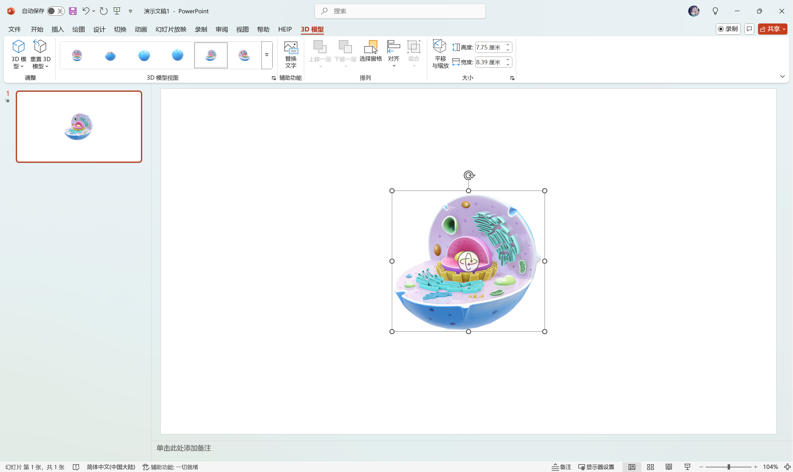

> 看这个博客内容就知道这是个学文科的。
>
> *——某位科协朋友的吐槽*

我平常会打些比赛，经常遇到需要团队共同完成一份展示用 PowerPoint 演示文稿（下简称 PPT）的场景，这其中的排版工作通常又是由我来把关的。奈何我所呆过的团队还没有见到能在排版技巧上超过我的（虽然我的团队定位是个技术人员），因此决定整理一篇我自己常用的排版和美化技巧，希望可以帮助大家更有效率的完成各种排版。

*咦，这话我是不是说过？*

## 阅览前注意

我所用的排版工具为 Microsoft Office 365 PowerPoint。本文所述的操作仅保证在该软件上可用，但理论上同时适用 Microsoft Office 2016 及以上版本。

请**不要**使用 WPS Office 排版。WPS 使用的动画以及排版方式、功能支持等与 PowerPoint 有一定区别。混用两个软件会有意想不到的后果。

这篇文章相对于讲 Word 的文章会有一些杂乱，因为这篇文章不会讲整个工作流，更像是实用技巧合集，还请见谅。

我**不是**设计专业。这也**不是**专业建议。文中提到的设计技巧仅供参考，欢迎交流指正。如果你真的做到了怎么调整 PPT 都不能满意的程度，首先恭喜你已经在竞赛这条道路上走的很远了，其次，不如去让专业的人去干吧，花钱找人美化。相对的，不到这个程度也不建议你孤注一掷。

***版权声明**：本文中所用 PPT 模板仅作展示用，版权归属于原作者。*

## 协作方法？

理论上，最佳且最有效率的协作方法仍然是**使用在线文档**，支持同时编辑，不需要将文档传来传去。然而，除非你是 Office 365 订阅者且可以正常访问 Office 在线服务，可以使用 Office 365 的在线文档服务，否则**暂时没有任何的在线文档服务支持制作精美 PPT 所需的高级排版和美化需求**。因此在大多数情况下，推荐 **PPT 内容和排版美化由不同的人负责**。团队成员之间应保持经常沟通，最好能线下一起商量，方便第一时间给出意见。当然，请尊重互相的意见，避免争吵。

## PPT 模板？

通常情况下，你不可避免地需要使用一个 PPT 模板，除非你真的很懂设计（这种情况下你也不需要继续读下去了），或是你参加的竞赛很水，不需要很好看的 PPT。为了良好的展示效果，花钱买模板很难避免，除非你能找到非常不错的免费资源。

### 怎么找？

如果你问的是“去哪里找免费又好看的模板”？抱歉，本文不提供这种途径。问这个问题之前不如去搜搜。

但是如果你不知道你该怎么找到你喜欢的模板，不如先确定一个**主题颜色**。如：对于科技风的 PPT，去找一个蓝色系的模板（通常深色的比较酷）；做农业的，去找一个绿色系的模板。

### 你该怎么用？

如果模板中的某一页符合排版要求，请不要客气，**直接不加修改使用该页**便没有问题。你可以做一些微小的调整，如字号修改等，改动地越少越好。模板的设计师通常已经帮你考虑好了这页的布局，所以直接用准没错。反倒是乱套用，这页挑一个元素、那页再挑一个元素，随便地组合在一起，一定会使别人说你在套模板。以下放一个错误案例：

请避免以下几个行为：

* 像上图那样不按比例缩放物件，**特别是图片**。缩放图片时你总是应该**按住 <kbd>Shift</kbd> 等比例缩放**；
* 在完全没有必要修改已有布局的情况下修改布局；
* 把另一个不属于背景的物件做成背景并堆叠，或是无脑堆叠本不改堆叠的物件；
* 使用另一个风格不同的模板的布局并强行应用之。同时使用两个模板的布局是可以被接受的，前提是两个模板风格相同。例如：除了标题艺术字以外，你应该避免在一个科技风格的模板中用带艺术字（并非 PowerPoint 自带艺术字功能，而是指那些使用花体字、毛笔字等艺术字体）的布局；
* 加入动画，无论是切换动画（翻页动画）还是物件动画（出现、消失等），除非模板本身包含这样的动画，或是有不得不这么做的理由。后文会详细讨论这点。

### 如何开始？

听起来似乎很简单，但是如果不注意的话会踩很多坑！

我个人推荐在拿到模板的第一时间**创建一个副本**，并**只在副本上进行修改**，这样子 PPT 的母版、主题颜色等各种设置都会被完整保留下来。此时如果你想从头编辑，你可以再删除所有页并从原模板复制需要的幻灯片并粘贴至需要的位置。

……啥？你问“母版”“主题颜色”都是啥？

如果你问出这种问题，那么你还没有接触到使用模板的基础。接下来我会解释。

### 还需要注意哪些？

这里我们规范一下标准的叫法：

* 一个 `.ppt` 或 `.pptx` 文件叫一个**演示文稿**，为了方便，本文可能会俗称之 PPT；
* 一个演示文稿中的“一页”或“一个画面”叫一张/页**幻灯片**，本文一直会遵守这点。请不要说“一页 PPT”了；
* 一张幻灯片内的某个图片、形状、文本框等可选择的对象称之为**对象**或**物件**。

#### 幻灯片母版

模板中有一些背景元素你觉得不需要，但是却不能编辑？这些通常被定义在母版中。这里借用 Microsoft 的官方文档：

> 若要使所有的幻灯片包含相同的字体和图像（如徽标），在一个位置中便可以进行这些更改，即幻灯片母版，而这些更改将应用到所有幻灯片中。 若要打开“幻灯片母版”视图，请在“**视图**”选项卡上选择“**幻灯片母版**”：
>
> 母版幻灯片是窗口左侧缩略图窗格中最上方的幻灯片。
>
> 编辑幻灯片母版时，基于该母版的所有幻灯片将包含这些更改。但是，所做的大部分更改最有可能成为与此母版相关的幻灯片版。
>
> 在“幻灯片母版”视图中更改版式和幻灯片母版时，正在处理你演示文稿（在“普通”视图中）的其他人无法因意外而删除或编辑你进行的更改。相反，如果你在“普通”视图中进行处理，并发现无法编辑幻灯片上的元素（例如，“为什么无法删除此图片”），这可能是因为尝试更改的内容是在幻灯片母版或布局母版上定义的。 若要编辑该内容，必须切换到“幻灯片母版”视图。

说的够清楚了哦。不再解释了。

#### 主题颜色

比较专业的 PPT 模板通常会为你定义好一套**主题颜色**。请善用他们，这是设计师认为在这个模板上最适合的颜色。若是模板没有自定义主题颜色，那不妨看看“最近使用的颜色”一栏。大多数情况下你只需要用到定义好的颜色，无论是强调色还是普通颜色。当然，这里不涉及复杂的文字排版，因此你可以安全地使用**格式刷**，一样是很方便的。

## 开始编辑

在做好准备工作，拿到需要的材料后，你便可以开始 PPT 编辑了。接下来的部分讲罗列我会用到的一些小技巧。

### 封面/标题页/结尾页

对于标题页/结尾页，大多数评委老师都喜欢看“高端大气上档次”的玩意，无论是什么类型的 PPT，都希望看到毛笔字/艺术字标题以及一个带一些渐变的背景，尽管我个人不喜欢这样的风格：

如果你使用的模板没有这样的封面/结尾页，你大概率需要手搓一张这样的幻灯片。这里需要用到两个技巧：蒙版与艺术字排版。

#### 蒙版

**蒙版**在 PPT 中通常表现为盖在背景图上方，部分或完全覆盖背景图的一个长方形。使用这层蒙版会给你的封面带来渐变效果，看起来会比较高级。对于上方展示的封面，其蒙版是这样的：

你可以通过**选中图形 - 右击 - 设置形状格式 - 形状选项 - 填充**菜单看到其具体的填充方式。通常采用方向为横向的**渐变填充**，最简单的变体是在两侧放同样的颜色，一侧设置透明度为 100%，另一侧设置 0%，便可得到一个简单的渐变。再将其盖在背景图上即可。你也可以采取不同的渐变方式，达到不同的效果。这里留给读者自行探索。

#### 艺术字排版

在标题中所用的艺术字通常为某个毛笔字体。以上面的图为例，你可以发现这四个字通常是**分开写在四个文本框里**的。相较于将标题全部写在同一个文本框内，这样做的好处是方便你进行更自由的排版。即使你觉得将四个字横着摆放就已经够了，我仍然推荐你这么做，因为这类字体的通病是不符合字体照排学的规矩，字间距会拉得很大，看起来会非常丑。

找一个合适的毛笔艺术字体，自由摆放试一试吧。当然，通常不同的字体会有不同的字体授权协议，请合法地使用字体。

## “开始”菜单

自此开始的操作都可以在“开始”菜单找到。思索再三，我还是决定采用分菜单断章节的方式，要不然实在是太乱了，不方便寻找。

### 组合

一个制作精良的模板通常会大量使用**组合**。你可以点击**排列 - 选择窗格**打开选择窗格（这个东西很重要，请一定记住！）。例如下图中，右上角的导航条（物件“组合 41”）就是一堆文本框和平行四边形的组合。这样的组合可以被嵌套（即组合之中再包含小组合）。如果你到现在还不知道有这个玩意，那你是真的不会做 PPT。

将很多物件通过**组合**操作组合后，对其缩放时会对整个组合整体缩放，而不是对组合中的每个对象缩放。需要注意的是，如果组合中有文字，文字的字号不会改变。通常缩放后有必要重新调整其中文字的字号。

如果你只需要某个组合其中的某个物件，或是调整某个物件的属性，在组合的情况下不能完成的，请对其使用**取消组合**。如果有必要，请再次对这些物件使用**组合**（如果**重新组合**可用，你可以直接使用之，PowerPoint 会自动帮助你重新组合上次取消组合的物件）。以上的操作都能在**排列**菜单中找到。

*如果需要同时选中多个物件，可以使用鼠标在空白处拖动（选择框必须大于物件大小），或是按住 <kbd>Shift</kbd> 或 <kbd>Ctrl</kbd> 同时点击物件。打开选择窗格的时候，你也可以直接点击选择窗格内的对应物件。不会有人连这个都不知道吧？*

### 图层

熟悉 PS 的人应该会很清楚这个名词。**图层**表示不同物件的层级关系。在上层的物件会覆盖下层物件。在**排列**菜单中，**排列对象**下方的四个按钮就是帮助你调整物件的图层关系的。你可以在选择窗格中看到具体的图层关系。使用选择窗格右上角的上下箭头按钮也可以调整当前选择对象的图层。

需要注意的是，对于已经组合的物件，其图层调整只能在组合中进行；组合也只能被整体调整图层（即视为一个物件）。

如果你发现某个物件被挡住，你就应该调整图层了。如果你只是想临时隐藏他们，以便编辑其下方的物件（比如文本框被图片挡住，你想编辑文本框中文字时），请在选择窗格中点击对应物件右边的“眼睛”图标以隐藏他们，而不是把他们拖走，编辑完再拖回来，这样你会弄乱你做好的排版。

### 对齐

不要傻傻地手动调整多个相同物件的对齐和居中操作啦，试试**对齐**功能吧！这个操作依然是在**排列**菜单中。

像是这样的四个框，我们就可以用对齐中的**横向分布**操作让他们快速对齐。首先，像上图一样将每个框内的所有内容选中并分别**组合**，然后选择四个组合好的物件，点击**横向分布**按钮，PowerPoint将自动按照最左和最右两个物件的位置帮你调整中间两个物件的间距，确保他们间距一致。纵向分布同理。如果你希望让某一个框直接居中，那选择**水平居中**或**垂直居中**即可。

如果你发现使用横向/纵向分布之后得到的结果很怪，那大概率是你漏组合了某个物体。撤销一下重试吧。

*快捷键提示：撤销 <kbd>Ctrl</kbd> + <kbd>Z</kbd>，恢复 <kbd>Ctrl</kbd> + <kbd>Y</kbd>。*

### 文字操作

#### 字体

选择一款好看的字体对于 PPT 整体展示的效果至关重要。标题的字体选择在上文讨论过，这里不再赘述。

通常情况下，PPT 的正文需要使用**无衬线字体**（如黑体）。通常默认的选择是**微软雅黑**，但如果你希望更进一步，可以试试使用一些网络上制作精良的开源字体/免费可商用字体。[这个链接](https://flowus.cn/share/12828fe3-8806-4350-bfbe-4fc1d032e5db#888c5596-dbbc-4cdb-be31-d72266a4a111)包含了许多免费可商用字体，应该够你用了（感谢 @展哥更新了 的整理）。在这里我也推荐一些我认为基本上百搭的字体：

* HarmonyOS Sans - 由华为设计的开源字体
* 思源黑体（Source Han Sans） - 由 Adobe 设计的开源字体
* Noto Sans - 由 Google 设计的开源字体

通常字体后标 Sans 表示其为无衬线字体（Sans-serif）。

但请记住，在决定使用这些三方字体时（包括标题艺术字），你需要保证**文件 - 选项 - 保存 - 将字体嵌入文件**为选中状态，且选中**嵌入所有字符**。这样你在一台新电脑打开该演示文稿时，才会正确显示字体。

#### 字体渐变

字体填充颜色也是可以设置渐变的！具体的方法和设置蒙版渐变的方法差不多，选择文字后右键，**设置形状格式 - 文本选项 - 文本填充与轮廓**。

#### 分散对齐

如果你希望文本宽度随着你的文本框长度而自动调整，试试用**分散对齐**而不是手动敲空格！

## “插入”菜单

以下大部分内容都可以在“插入”菜单中找到，部分会涉及其他部分。

### 图片

#### 更改图片

通常一个 PPT 模板会带很多图片。请记住：所有的图片都是可以替换的，除非做模板的人不希望你用他的模板。如果你正好有比例适合的图片，请你直接**右击图片 - 更改图片**即可。不需要再额外插入图片了。就这么简单。

如果选择的图片和原图片比例不相同，PowerPoint 可能会裁剪或缩放图片，这点还请注意。你可以在替换后手动裁剪，但最好是在替换前把图片裁剪好。

如果你真有必要手动插入图片，你可以使用**格式刷**应用图片的边框、投影等属性。是的，图片可以使用格式刷！视频也可以！

#### 设置图片格式

通常不建议你随意修改，毕竟模板应该有足够的图片够你借鉴。但是如果你真的要改，那基本上是和上面一样的操作。

#### 图片效果

看到下面那些稍微有些倾斜的图片吗？实际上这是通过**图片格式**菜单内的**图片效果 - 三维旋转**实现的。你可以尝试不同的组合，使平面的图片看起来更立体。

#### 删除背景

在**图片格式**菜单内有 Microsoft 自带的**删除背景**工具，虽然不是很好用，但能解决大部分简单的问题。你可以用**标记要保留/删除的区域**按钮修正抠图结果。这里就不做展示了。

如果你的图片比较复杂，那还可以使用 AI 抠图工具，比如 [remove.bg](https://www.remove.bg/zh)。虽然不是完全免费的，但预览版的质量已经够用了。

#### 手机 Demo

这其实不算是 PPT 使用技巧，算是我附赠的一个部分吧。如果你的项目涉及移动端的展示，你很大可能需要展示一个带手机壳的 Demo 界面：

如果你想快速地生成这样的展示图（无论是手机还是电脑），可以试试用 [MockUPhone](https://mockuphone.com/) 生成像上面一样的平面的图片，或是用 [HEIP 插件](http://www.heibaijiansheji.cn/heip%E6%8F%92%E4%BB%B6/)中的**创意工具 - 设备样机**功能生成立体的图片。

### 图形

通常**不建议**你自己插入图形，因为模板中给出的图形已经足够使用，直接借鉴即可。这里只讲一个小操作：双击图形内部可以**编辑文字**，即在图形中直接插入文字，不需要文本框。大部分情况下该功能足够满足你的需求，但如果你的图形本身比较奇怪，直接插入文字会使文本溢出到图形外，那使用文本框才是明智的选择。编辑文字的操作对于图片同样适用。

……好吧，其实你可以直接无脑全部用文本框的。

### 图标

通常一个 PPT 模板也会带很多图标。如果不加思考地直接往上套用，很可能出现图标和文字内容对不上的问题。如果你是 Office 365 订阅用户，你可以直接访问图标库。直接点击**图标**按钮你就能使用各种图标了，无论是空心的还是实心的。如果不是，你可以找找网络上的免费图标库，比如 [Tabular Icons](https://tablericons.com/)。

*Office 365 还是很方便的，你可以使用 Microsoft 提供的许多素材，包括素材图、图标、透明的人像抠图、视频等。*

如果你只需要图标的一部分，你还可以拆解他们。执行**取消组合**操作即可，PowerPoint 会帮你将其转换为可编辑的对象。

### 3D 模型

*注意：本特性只在 PowerPoint 2016 及之后的版本可用，WPS 仅可展示不可编辑，但动画会展示出错。如果你已知展示/答辩用的电脑仅支持 WPS 或更早版本的演示，请考虑删除动画或直接放弃使用 3D 模型。*

如果你的项目中有很酷的建模，你可以将建模导出并直接插入到 PPT 中进行展示，甚至可以插入动画（虽然我不喜欢动画，但是这其实还真的挺酷的）。

如果你是 Office 365 订阅用户，你还可以使用 Microsoft 的素材库，里面甚至还有自带动画的模型。这里我们就用素材库中的模型做演示（我选择了一个动物细胞）。

插入模型并选中该模型后，你可以看到 **3D 模型**菜单。其中，**3D 模型视图**中会内置一些预设视角，你可以直接应用他们，或是拖动模型中央的旋转图标手动旋转之。**重置 3D 模型**按钮将恢复模型到其默认视角。

这时如果进入**动画**菜单，你可以看到一些仅适用于 3D 模型的选项：

具体动画是什么效果这里就不作展示了。请读者自己试试看吧，用得好效果会非常惊艳的。这里我只放一个基础的例子：比如你希望该细胞在你讲的时候持续不停地旋转，此时你便可以使用**转盘**动画并设置**效果选项**为**连续**、**旋转轴**为**对象中心**。

## “设计”菜单

如果你是使用模板的，那你基本上用不到这个。唯一需要注意的是，除非你有特殊的考量，否则幻灯片大小推荐为宽屏（16:9）而非 4:3。不仅是因为宽屏已经是主流显示器的标配，而且宽屏比例会带来更多布局空间。

## “切换”菜单

在这里你可以指定切换时使用的动画（下称“翻页动画”）。通常情况下你**完全没有必要**加上翻页动画。但如果你确实觉得你的展示不够丝滑，你可以考虑使用**淡入/淡出**或**平滑**动画中的一种。其余的翻页动画太过花哨且没有必要，只会分散听讲人的注意力。

### 平滑动画

*注意：此特性仅支持 PowerPoint 2016 及以上版本。WPS 虽然支持，但其移动算法和 Office 有区别，操作不当可能会出现意想不到的问题。*

让我们先看看 Microsoft 的官方描述：

> 平滑切换功能可将从一张幻灯片到另一张幻灯片的平滑移动具有动画效果。
>
> 可对幻灯片应用平滑切换，以在各种对象（如文本、形状、图片、SmartArt 图形和艺术字）之间创造移动效果。但是，图表不会变化。
>
> **如何设置平滑切换**
>
> 若要有效地使用平滑切换，需要有两张幻灯片，其中至少有一个共同对象，最简单的方法是复制幻灯片，然后将第二张幻灯片上的对象移动到其他位置，或者复制并粘贴一张幻灯片中的对象并将其添加到下一张幻灯片。接着再对第二张幻灯片应用平滑切换，以查看平滑如何自动形成对象的动画并移动对象。以下是操作方法：
>
> 1. 在左侧的缩略图窗格中，单击要向其应用切换的幻灯片，该幻灯片应是要在其中添加应用了平滑效果的对象、图片或文字的第二张幻灯片。
> 2. 在“**切换**”选项卡上，选择“**平滑**”。

也就是说，连续的两页中如果有相似元素（可以缩放或编辑图形文字，PowerPoint 可以识别到），那么 PowerPoint 在翻页时会自动为其加上补间动画。正如上文所说，**复制粘贴**是制作平滑动画最好的方法，可以保证平滑动画按预期生效。利用这个功能，你可以轻松地制作动态的流程图，点一下就出现一个框的那种，比起在页面上加一堆动画少了很多工作，而且更美观。*当然，如果你的比赛限制 PPT 的最多页数，这个技巧还是少用……*

需要注意的是，如果元素被包含在了一个组合中，PowerPoint 不会为其生成补间动画。你也可以反过来利用这个特性阻止 PowerPoint 自动创建你不希望看到的动画。你也可以用平滑动画的**效果选项**来控制哪种对象需要被平滑动画过渡。通常情况下选择**对象**可以满足大部分需求。选择**文字**或**字符**虽然很酷，但满屏幕的文字乱飞，实在是太分散注意力了。

以及，不管使用的是哪种翻页动画，都请注意**持续时间**。平滑动画的默认持续时间是 **2 秒**，这个时间略有些长，对于答辩这种紧张环节，有这 2 秒的动画会导致你的演讲中间有很多的空当，连续性不是很好。一般情况下，设置为 **1 秒** 的效果我认为是最平衡的，有必要的话还可以更短。

如果你不想一个一个设置，你可以点击**应用到全部**按钮统一应用这个动画。

当然，还是那句话，实际上做动画是完全没有必要的，除非你认为使用动画会让你的演讲逻辑更为清晰，否则你直接把流程图这种东西完整放出来也无伤大雅，还不会浪费翻页所占的时间，更不会分散听讲人的注意力。

## “动画”菜单

上文提到的“切换”是对整个幻灯片的，对于单个物件则是使用**动画**。

就如上文所说，对于一般答辩用的 PPT，动画是**完全没有必要的**。此处不再赘述理由。虽然我自认我还算擅长制作动画的，还尝试用 PPT 动画基本还原了[《原神》可莉的角色演示开头部分](https://www.bilibili.com/video/BV18D4y1d7Uz)，但是这里我不希望扯太多。如果有必要的话，这部分我会单开一篇文章。

## “幻灯片放映”菜单

此处没有什么需要注意的，但需要提一个小点：

如果你使用的 PPT 模板在放映时会自动翻页，是因为其设置了排练计时。请在此处禁用**使用计时**选项。

## “视图”菜单

这部分是方便你进行编辑的辅助部分。

通过更改**演示文稿视图**，你可以尝试不同的浏览模式。如果你需要批量修改幻灯片的顺序，你可以选择**幻灯片浏览**视图。你还可以通过右下角的按钮快捷进入该视图。

上述提到的**幻灯片母版**操作就在这里。

如果你觉得手动对齐某些物件比较困难，考虑开启**网格**、**标尺**和**参考线**其中的一个或几个。点击旁边的**备注**按钮会展开/缩起幻灯片下方的备注框，在那里可以填写一些备注。在默认的放映模式下，如果存在多台显示器，这些备注会被展示在一个显示器上作为提示，同时 Powerpoint 还会预览下一页。

## 其他操作

这边会记录一些我觉得有必要的其他操作（比如快捷键）。

这些内容实际上都是**常识**。不会的话，那么你小学的微机课一定没好好上。

### 快速复制

按住 <kbd>Ctrl</kbd> 的同时拖动物件可以复制该物件。

### 水平/垂直移动

按住 <kbd>Shift</kbd> 的同时拖动物件可以保证物件水平/垂直移动。

上述两个键可以一起按，达到**水平/垂直复制一个物件**的效果。不要给我再 <kbd>Ctrl</kbd> + <kbd>C</kbd>/<kbd>Ctrl</kbd> + <kbd>V</kbd> 了！

### 等比例缩放

按住 <kbd>Shift</kbd> 的同时缩放物件可以等比例缩放。在插入图形的时候按住 <kbd>Shift</kbd> 可以保证插入的图形长宽一致。

### 中心缩放

按住 <kbd>Ctrl</kbd> 的同时缩放物体可以使图形中心缩放。在插入图形的时候按住 <kbd>Ctrl</kbd> 可以保证绘制出的图形以光标初始落点为中心。

上述两个键可以一起按，达到什么效果不用我说了吧。

## 终于结束啦！

再次搬一下隔壁文章的致谢：

大概能想到的操作就这么多了。水平有限，如果有需要补充/指正的，欢迎在评论区留言。这篇文章是我设立这个博客写的最累的一篇了，也不知道能帮到大家多少。总之，感谢你读到了这里，愿我们能共同进步！

希望这是我最后一次写这种文章了。

我好累啊。
