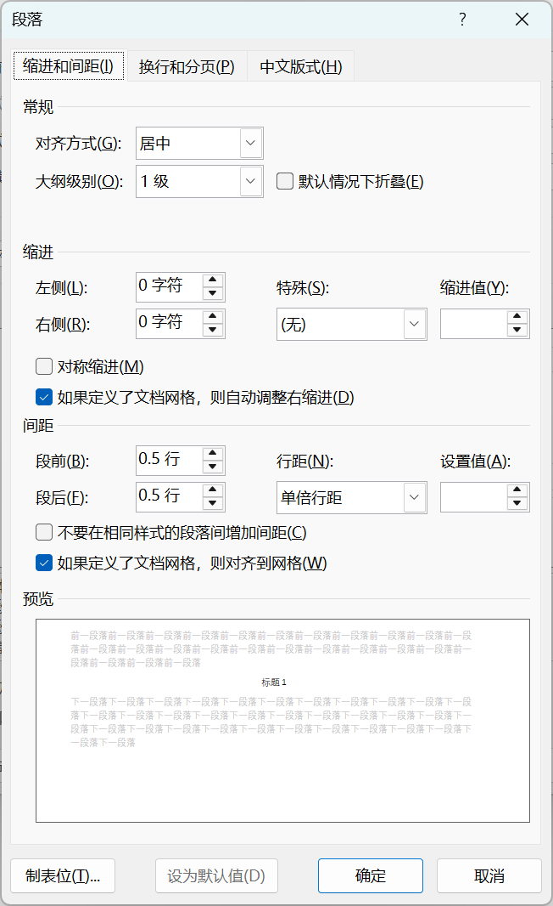
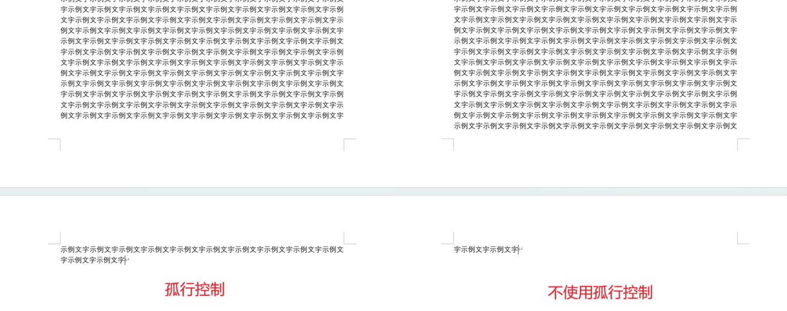
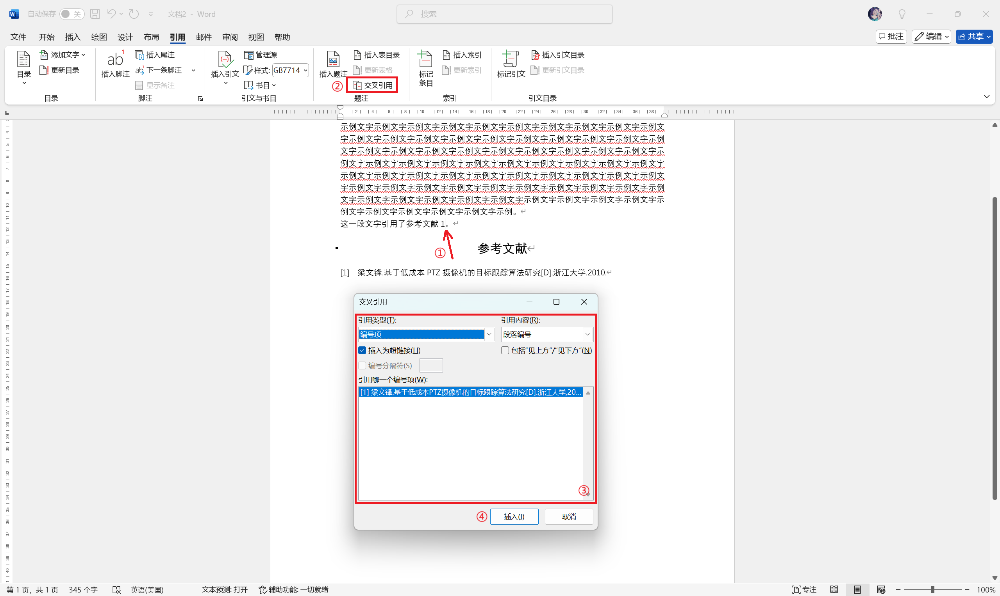
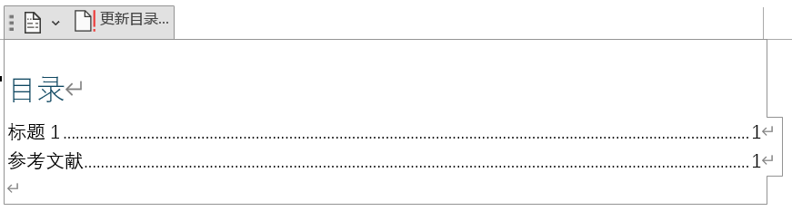

我平常会打些比赛，经常遇到需要团队共同完成一篇技术文稿/论文的场景，这其中的收尾排版工作通常是由我来把关的。奈何我所呆过的团队还没有见到能在排版技巧上超过我的（虽然我的团队定位是个技术人员），因此决定整理一篇我自己常用的排版技巧，希望可以帮助大家更有效率的完成各种排版。

## 阅览前注意

我所用的排版工具为 Microsoft Office 365 Word。本文所述的操作仅保证在该软件上可用，但理论上同时适用 Microsoft Office 2013 及以上版本。

请**不要**使用 WPS Office Word 排版。使用 WPS 排版出来的文档在 Word 上打开会出现意料外的区别。

实际上，如果你希望一步到位，最好的方法是使用专业的排版工具，如 Typst、LaTeX 等。他们最大的特点在于他们**不是所见即所得（WYSIWYG）编辑器**，需要你使用类似于代码的语法进行排版，具有较高的门槛，但能保证排版正确（所见即所想，WYSIWYW）。我个人非常推荐你掌握至少一种这样的排版工具，特别是当你有论文投稿需求时。这里不提供这两者的比较，还请感兴趣的读者自行搜索。

## 合理的工作流

理论上，最佳且最有效率的工作流是**使用在线文档**，支持同时编辑，不需要将文档传来传去。然而，除非你是 Office 365 订阅者且可以正常访问 Office 在线服务，可以使用 Office 365 的在线文档服务，否则**暂时没有任何的在线文档服务支持论文所需的高级排版需求**。因此在大多数情况下，无论是通过网盘、版本管理工具还是直接通过聊天软件传文档，文档都需要在不同编辑者之间传递并进行版本迭代，此时便需要有人专门进行校对和格式调整（下称*排版者*）。在此提供两种较为合理的工作流：

1. 在开始编辑前便**使用修改样式功能**定义好标题、正文等格式，后续编辑者编辑时**必须使用预设的样式**编辑（**不要**使用格式刷或手动调整格式），最后由排版者进行检查；
2. 在开始编辑前不定义格式，但所有编辑者**必须使用 Word 默认预设样式**进行编辑（不做任何调整），最后由排版者**使用修改样式功能**进行统一修改[^1][^2]。

[^1]: 如果所有编辑者都熟悉 Markdown，可以尝试使用 Markdown 协作编辑，用 Pandoc 等工具导出为 Word 文档后再自定义样式。**此方法未经过尝试，不能保证使用工具导出的文档在编辑样式时是否会出现问题。**

[^2]: 上述所有操作可以完成的前提条件是**所有人都使用相同的默认样式配置**。建议所有编辑者使用同一版本的 Office。

我个人推荐第 1 种工作流，可以极大的减少排版者的负担。但若多数编辑者不擅长 Word 操作，则使用第 2 种工作流门槛更低。若排版者愿意多做一点工作，也可以要求不同编辑者分开工作，向排版者分别提交自己部分的 Word 文档，最后由排版者整合为一个文档。在这种情况下，如果出现一位编辑者需要负责不连续的多个段落的情况，建议**将不同段分开保存**而不是合为一个文档，方便排版者拼接。例如：编辑者 1 负责段落 1、3，编辑者 2 负责段落 2，正确的段落顺序为 1、2、3，则编辑者 1 需要将段落 1、3 分别保存为两个 Word 文档。

## 使用样式功能

上述工作流种提到最多的一段话便是**使用修改样式功能**。这是排版能够快速进行的核心操作。“样式”菜单可以在这里被找到：


### 了解段落

在开始排版之前，我们首先要有段落的概念。

通常，按下 Enter 之后，Word 会为你**分段**，将你刚刚键入的文字划为一个**段落**，此时你就可以为这个段落设置统一的**样式**。

Word 会用一个符号标记内容在此处分段（黄色高亮部分）：


同样的，Word 也允许换行时不分段，此时应使用 Shift + Enter 换行。Word 会用一个下箭头标记该换行。


注意到在没有分段的时候，下方的示例文字仍为标题样式，则表明此时上下仍为同一段落。

### 修改样式

我们以某大学“挑战杯”商业计划书格式要求为例，对样式进行修改。

* 章标题：三号，黑体，居中。
* 节标题：四号，黑体，居左。
* 条标题：小四号，黑体，居左。
* 正文：小四号，中文字体为宋体，西文字体为 Times New Roman 体，首行缩进，两端对齐。
* 行距：章、节、条三级标题为单倍行距，段前、段后各设为 0.5 行（即前后各空 0.5 行）。正文为 1.5 倍行距，段前、段后无空行（即空 0 行）。

点击样式菜单右侧的箭头展开下拉菜单，你会看到这样的菜单：


此时你可以点击**创建样式**创建新样式，或是**右击现有样式 - 修改**直接在原有样式基础上修改。此处我们将直接修改原有样式（章/节/条标题分别覆盖标题 1/标题 2/标题）。

我们以标题 1（章标题）为例讲解每个条目的具体作用。


* 样式基准：基于某个样式进行修改，选择一个样式后会将该样式的配置复制过来。
* 后续段落样式：字面意思，编辑时按下 Enter 换行，进入下一个段落时默认的样式。通常选择“正文”能满足大部分需求。
* “格式”框种部分：第一行设置字体、字号、字形、字重、颜色等；第二行用于设置简单的段落格式。实际上除了对齐之外，行距、缩进、段前后空行一般不在这里设置。
* “添加到样式库”选项：通常情况下选中，这样你的样式才能被保存。
* “自动更新”选项：通常**不建议**选中。选中后你在编辑时对该段落进行手动的格式修改时会自动更新对应的样式，这样不便于你对一些特殊要求进行处理。

其余没有提到的条目，保持默认即可。读者可以自行探索。

我们选择“三号黑体居中”对应的选项。但请注意：我们还没有设置行距。点击**格式**按钮，你会发现更多可以设置的选项。我们选择**段落**，并按照要求设置行距。

#### 段落设置



如果你发现选项框内的单位错误（如段前/段后间距默认单位为磅），你可以手动输入正确的单位。此处直接在框中输入“0.5 行”即可（**数字和单位之间需要空格**）。

由于我们修改的是“章标题”（**一级标题**）格式，我们需要将大纲级别设置为 **1 级**。对于二级、三级标题等同样需要注意这点，否则在需要生成目录的场景下，Word 将不能正确识别到标题。

对于正文，大部分情况下需要**首行缩进**。此设置可以在**缩进 - 特殊 - 首行**中找到。有些时候，Word 会默认缩进 0.74 厘米/0.28 磅[^3]，此时可以和上面一样，直接键入“2 字符”覆盖错误的单位。

[^3]: 如果你总是遇到此问题，请点击**文件 - 选项 - 高级**，在**显示**一栏中将**度量单位**设置为**厘米**，并开启**以字符宽度为度量单位**。

在“换行和分页”“中文版式”页中，你还可以找到更多有用的设置。这里举一些例子。


* 孤行控制：防止在页面顶端单独出现一行的情况。例如，你的内容刚好占一页带一行，打开该选项时，Word 会将倒数第二行划到下页。通常，专业文档要求正文使用孤行控制。
  
* 与下段同页：建议在标题中使用，正文中不使用，可以避免标题出现在页面底部。
* 段中不分页：打开后 Word 会尽量让一个段落在同一页中显示。同样建议在标题中使用，正文中不使用，可以避免标题换页。
* 段前分页：如果有一级标题强制分页的需求，请使用它，而不是使用分页符，更不是狂敲 Enter。

“中文版式”页中的内容在此不做讨论，通常保持默认即可。感兴趣的读者请自行探索。

在此处我们勾选图片中的选项，此时段落设置便完成。

#### 字体设置

先别急！注意到此时西文标题还在使用“等线”字体，通常这是不符合规范的。再次点击**格式**按钮，选择**字体**。


对于黑体，其自带西文字体，此处直接**使用西文字体**即可。但请注意的是，这些较老的中文字体的西文字体通常为**等宽**的，不适用于正文。如果正文中需要使用，你需要将西文字体设置为其他合适的字体。本例中，正文明确要求了**宋体 + Times New Roman**，这也是大部分文档的要求。

至此我们便完成了**章标题**样式的设置。之后，按照相同步骤设置其他样式即可。**请务必为每一种不同的段落都设置一种样式**，包括图名、图（设置居中）、表名等，即使他们只使用了一次。

#### 编号设置

如果你的标题需要设置编号（如 `一、标题 1`），你可以点击**格式**，选择**编号**并设置正确的编号格式。


若没有需要的编号格式，你可以**定义新编号格式**，只需选择对应的编号格式、在编辑格式框中输入正确的格式即可。我们以定义 `[1]` 这种编号为例：


需要注意的是，此方法不适用于类似 `1` `1.1` `1.1.1` 这样的编号格式。这种编号格式在 Word 中称为**多级列表**，在样式编辑中**不支持**。此时需要你手动添加这些编号。当然，你可以手动键入所有类型序号，只不过这样不能自动更新序号。

通常，编号设置需要在**段落设置之前**完成，因为编号设置后会覆盖段落设置的内容。在带编号的标题中，段落设置中的**缩进**尤为重要。

在带编号的段落中，应使用**悬挂缩进**而非首行缩进，即使要求需要首行缩进。此时的首行缩进应被**左侧缩进**替代。悬挂缩进的字符数量应与序号占有的字符数量**保持一致或大于该数**（以中文全角字符计算，一个英文字符/数字符号可估计为 2 个中文字符），取决于怎么设置最舒服。例如：假设三级标题中要求首行缩进 2 字符，使用如 `1.` 一样的序号，则合理的设置为**左侧缩进 2 字符**（对应首行缩进），**悬挂缩进 1 字符**（序号占至多 1 个中文字符的空间[^4]）。得到的效果如下[^5]：

[^4]: 实际上由于字距调整（kerning）的作用，序号占的空间不足 1 个中文字符。

[^5]: （二）一行则采用了悬挂缩进 3 字符的方案，因为序号占了 3 个中文字符的空间。


正确设置缩进后，可以保证中文字符对齐，看起来较为美观。采用 Word 默认设置则一般达不到这种效果。

### 开始编辑

不管是在编辑前设置样式，还是编辑后再设置样式，所有编辑者**必须**使用样式功能进行编辑，**禁止手动编辑格式**，**禁止使用格式刷**，否则文档大纲有可能不能正确被 Word 识别，后续统一排版，制作目录时会非常麻烦。

当光标**置于一个段落**时，点击对应的样式即可自动套用到整个段落。**不需要选中段落**。若选中段落则必须选中整个段落，否则样式只会套用到段落的一部分。如果需要选中多个段落套用样式，这点尤其需要注意。

对于正文部分，此时可以安全的进行手动的文本加粗、斜体等操作。**避免对一整个段落都进行改动**。就内容上来讲，通过将一整个段落加粗标为重点也等于没标。

## 交叉引用

交叉引用在论文排版中很常用，文章的尾注（参考文献）[^6]、涉及序号的部分都使用交叉引用实现。

[^6]: 虽然 Word 有自带的脚注/引文功能，但是可自定义性低，一般不能满足需求。感兴趣的读者可自行探索，我也很欢迎读者交流自己的解决方案。实际上，使用专业的排版工具才是最优解。使用例如 BibTeX 等工具可以直接管理所有引文并自动生成正确的交叉引用，还支持各种规范。各大学术平台也支持使用 BibTeX 格式导出参考文献。

### 尾注/参考文献

通常中国大陆要求的引文格式规范为 GB/T 7714-2015。国内各大学术平台都应该提供了这一格式的引文，你可以直接使用。若你希望参考在线文章（博文、文档等）不存在于学术平台上的文章，你可以使用 Cite This For Me 等工具生成引文（注意选择上述规范）。

以下是一个符合 GB/T 7714-2015 规范的引文：

```text
[1]梁文锋.基于低成本PTZ摄像机的目标跟踪算法研究[D].浙江大学,2010.
```

在 Word 中，我们固然可以直接使用这段文字，并手动修改序号、插入对应序号到引用位置。但使用交叉引用功能，可以让该过程更简单，并能在序号更新的时候同步更新文档中对应部分。我们将以上述引文为例进行讲解。

首先，请参考之前的步骤创建一个“引文”样式。如果规范了引文的排版格式，也请在此处设置好。不要忘记设置编号格式为 `[1]` 这种格式。为所有的参考文献套用这样的格式，序号会按照顺序自动生成。像这样：


选中需要插入序号的地方，此例中为“参考文献 1”和句点之间（通常序号放在标点符号前），点击**引用 - 交叉引用**，选择**引用类型**为**编号段**，**引用内容**为**段落编号**，选择对应的参考文献，点击插入，便可看到序号 `[1]` 被插入到了正文中。



此时选中该序号，点击**上标**即可使序号变成上标。


至此该参考文献已经被正确引用/参考。注意到当“交叉引用”窗口打开时，你仍然可以进行选择操作，因此若条件允许，你可以在文档完成后再批量进行该操作。

### 图名/表名

这是我最近才意识到的操作。早期编辑文档的时候，图名/表名中的序号都需要我们手动排序并检查，即使这样仍然会出现漏号跳号的情况。由于交叉引用依赖于编号，因此自定义一个编号规则便可以完美解决该问题。

同样，参照之前的步骤创建“图名”“表名”样式（需要**分开创建**，否则序号会混乱），并设置好要求的格式。对于编号样式，定义一个类似于这样的编号格式（编号中中文和数字之间默认不空格，需要你手动将**中文和数字之间用空格隔开**）：


此时便可以按照设置参考文献一样的步骤设置图名的引用了。此处不再赘述。

## 自动目录

*不会有人到现在还不知道 Word 有自动生成目录的功能吧……*

假设你正确执行了上面的流程，Word 应该会正确识别到文档大纲，并可以为你自动生成目录。点击**引用 - 目录 - 自动目录**即可生成。


自动目录有一定局限性，它**只能显示三级标题以内的内容**。暂时没有办法自定义显示的级数。自动目录虽然自动生成，但其更新为手动。内容有变化时，别忘记点击**更新目录**。



如果自动生成的目录不够美观，你还可以将光标置于某个条目，通过拉动标尺或是使用段落菜单手动调整每一级的缩进。**同级条目的缩进会一起被改变**。


自动目录通常套用**正文**样式，如果对样式不满意，你**只能手动调整**，因为套用样式时会破坏目录结构，这点还请注意。

## 其他常用操作/提示

以下列出一些很常用的操作，这些操作在文章编辑中较为简单，你应该已经掌握。但如果忘记的话，可以来这里看看。

### 页眉和页脚

双击页面顶部/底部空白部分进入页眉和页脚编辑状态，按 ESC 或在页眉和页脚菜单中点击**关闭页眉和页脚**退出编辑。

#### 插入页码

在页眉和页脚菜单中选择**页码**，按照需要选择页码的位置和格式。没有满意的格式时，可以插入现有格式后再手动修改。

#### 为不同页设置不同的页眉/页脚

需要**分节**。在**布局**菜单中找到**页面设置 - 分隔符 - 分节符**并插入对应的分节符，常用**下一页**。

如果只是首页/奇偶页需要设置不同的页眉/页脚，在页眉和页脚菜单中启用**首页不同**/**奇偶页不同**选项即可。

#### 插入当前页中的节标题

在页眉和页脚菜单中选择**文档部件 - 域**。在弹出窗口中选择**域名**为 **StyleRef**，**域属性**为你需要显示的标题样式名，点击确定即可。

### 输出文档为 PDF

点击**文件 - 导出 - 创建 PDF/XPS 文档 - 创建 PDF/XPS**即可[^7]。如果你电脑里还装有 WPS Office，你可能在编辑界面就能看到“导出为 PDF”选项。请**不要**使用那个工具，如果可能的话，尽快把你的 WPS 卸载。

[^7]: 其实调用的还是打印服务，因此这和使用打印 - Print to PDF 效果是一样的。

### 关闭 Office 加载项

如果你的电脑中有程序（如 WPS Office，百度网盘等）未经你允许在你的 Office 中加入了加载项，但你不想要他们的话，请这样禁用他们：

**文件 - 选项 - 加载项 - 选择一个 COM 加载项 - 转到... - 取消勾选/删除不需要的加载项**


如果可能的话，请在系统菜单中**卸载**这些程序。我非常讨厌这些软件的行为。

OfficePLUS 是由成都艾斯莱德网络科技有限公司运营，和微软中国合作的 **Office 插件**，在中国大陆的 Office 产品中自动安装，**不是 Office 自带功能**。如果你已经是 Office 365 订阅者，你可以免费使用所有 Office 365 提供的模板，大可**不用交这个智商税**。这里强烈谴责这个捆绑安装行为，并建议所有人在系统中**卸载 OfficePLUS**。

## 后记

大概能想到的操作就这么多了。水平有限，如果有需要补充/指正的，欢迎在评论区留言。这篇文章是我设立这个博客写的最累的一篇了，也不知道能帮到大家多少。总之，感谢你读到了这里，愿我们能共同进步！

*什么时候世界上的所有文档都能采用 Markdown 格式……我不想用 Word 了……*
