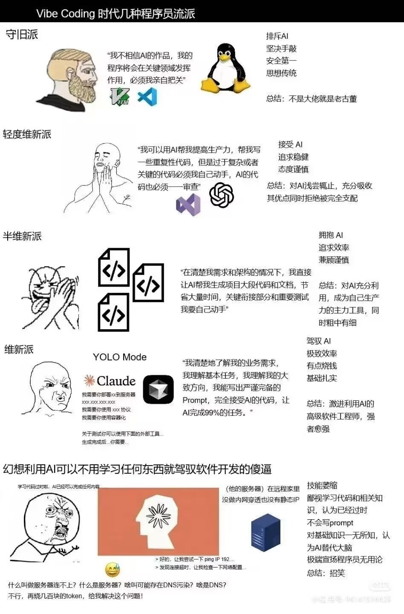

> 封面图由 Nano Banana 3 创作。

我其实一直在抗拒写这篇文章，甚至有些抗拒继续前进，但最终还是决定有必要写一篇这样的文章。首先，这样同质化的文章已经太多太多，对 AI 的看法众说纷纭，不差我这一篇。其次，这篇文章被某些人看到绝对会喷我一下。毕竟有些人（虽然没有恶意）就是这样恶趣味。以及，我的语文不行，真不擅长写这种谈论感想的文章。

这次的五一假期前后正好没课，给了我一个九天的小长假，得以让我思考接下来的方向和行动。因此写下这篇文章，记录一下目前的心境，给我之后留一个参考吧。

## AI 好用吗？

好用。太好用了。

在生产中具体多好用我不知道，反正大厂都在使用，并且大力支持。程序员的产出比 AI 时代到来之前多了 5 到 10 倍，而且理论上更轻松了。

当然，实际体验下来不是这么回事。我只觉得是很恐怖的一件事情。为了效率着想，我不得不弃用所谓“古法编程”开始使用各种先进的代码工具——我配了 Claude Code、Codex 和 GitHub Copilot。我开始使用中转站和公益站体验 Claude 和 GPT 最新最热的模型。我只读完了 [Go by Example](https://gobyexample-cn.github.io/) 就开始编写代码——结果我其实没写过一行代码。唯一的 Human in the loop 就是我坚持不开 YOLO 模式，每一条命令和修改我要亲自审批，即使 90% 的代码思路我完全看不懂。

这完全打乱了我的学习计划：过完基础，自己上手搓一个项目，理解透彻，吃透彻。这是以前学习代码的范式，just implement something，这很正常。但是我没有这个时间，职场也没有这个时间等我。我决定“我准备好了，我要开始搓项目了”的时候已经是大厂春招末尾（4 月初），同学都早早把简历投出去了。于是我不得不把整个学习过程反过来：先 vibe coding，然后再用 AI 解读 vibe coding 出的代码供我学习，原汤化原食。

## Vibe Coding 结果如何？

我接手了社团的一个老项目，准备把它重构了。这玩意原来是 TypeScript 写的，维护性不佳，我给改到 Golang 了。那时候还是 GPT Codex 5.3，两天时间后端就搓完了，原来的功能全都有。有乐于助人的前辈直接用 Next 给我搓了套前端（当然，他也是纯 vibe 的，他自己技术栈是 C++ 客户端），这个新系统 5 天就上线了。大家都用的好好的，我们也在不断加新功能，整个项目稳步推进中。

所以，我从中得到了什么？答案是几乎什么也没有。在此过程中我得到的正反馈极少。没有看着代码跑通的喜悦，没有给一个新功能调试完的自豪，几乎没有。我虽然知道整个项目是如何工作的，但是我仍然不会写任何代码。Golang 的核心、Gorountine、协程、信号、通道和阻塞……我从来没有自己设计和考虑过。AI 的代码现在很完美，能跑通。我在背后只是个指挥家——这听起来很神圣，毕竟指挥 AI 是需要一定知识水平的，别连 Markdown 都不知道是个啥就来招笑。但是我只感觉我是多余的——没有我的指挥，给 AI 一个 target，让它自己烧 token，它估计也能解决大部分问题。

这确实像是一个解放生产力的过程，但实际上我感觉我比之前更累了。很多时候我跟不上 AI 的思路，从空仓库开始 AI 很快就给我 diff +1000，我只能草草过一下，`go build` 没问题就放。其中留下的技术债，安全风险等等，对项目长期的发展有什么影响，我一概不知。

Vibe 的结果如何？从产出来看是极佳的。至于对于个人的提升？除了知道了一些“如何与其他在开发的伙伴对接”“如何解决这个特定场景的问题”之外，便什么也没有了。这些工作里会用到的实用技巧，通常只能是平时积攒下来的，而 vibe 跳过了这一阶段。同样的，这也导致面试的时候什么也说不出来。（当然，目前的面试大多数还得看八股文刷算法，这是比较诟病的一点，我这里不做讨论。）

## AI 带给我们的，与没办法带给我们的

正如上面所说，AI 无法带给我们做事的经验。在用 AI 之前，先得学会如何用 AI。在圈子里面流传着这样一张图，这张图和我想传达的事情一致：

不要妄想着不会写代码就能写出好用的东西来，好好学吧。大厂正盼着这些妄想指挥一只龙虾就能帮自己干好所有东西的人给他们去爆金币。这里也多嘴一句：不推荐任何人盲目部署各种龙虾，除非你知道自己在干什么。这句话不是我一个人在说，国家安全部门也在说。警惕 AI 幻觉。（讲真，这 OpenClaw 火的真是不明不白。）

我也庆幸这个时代的老师至少有与时俱进，在教同学使用 AI IDE，比如说 Trae 这种（这里不提那些好用的 CLI 工具比如 Claude Code 什么的主要还是条件不允许，谈国产优先，虽然我觉得大部分老师还没接触到这些很香的工具）。这至少比崇尚古法编程，唯语言论，觉得老资历都是用 C、Java，Python Golang 什么的都是没用的老师要好的多。但是大部分同学，就我观察下来，已经适应了上课不听课后问豆包的模式（豆包的模型虽然不强，但是对自己的产品定位做的太清晰了以至于下沉市场几乎它一家独大），自然这种新东西如果没有足够的宣发是不会被他们看见的，或者说，他们根本不想面对，也没有耐心面对怎么也看不懂的 IDE，因此轮到他们写代码时，仍然是给豆包提需求然后复制粘贴。

AI 确实加速了一些学习的进程，减少了一些学习的成本，改变了许多学习的范式。至少 AI 出现之后，程序设计周没有人在请代做了。依稀记得大一下学期搞程序设计，写管理系统，全班就我们一组人用 PyQt 写，写的还是比较难的主题。其他组全部请了代做（或者是有学长帮忙），代做也很逆天，函数和头文件用序号命名，混淆拉满，防止他们拿到代码二改，必须找他们改，得加钱。老师检查其他组的进度时都一堆 bug 一堆需求，这个字段没做校验，那个输入什么就崩溃啥的。我们就很爽，有 GUI 兜着，没办法输入不合法的数据。

## 该怎么做？

说实话我也不知道。我看过很多案例：有些人趁着 AI 热潮吃到了红利，有些人没有。没有两个人能给出同样的成功范式。没有范式可以抄。这需要很大运气和洞察力。自然，我也没有资格谈论如何去正确的做，毕竟我认为我没有成功。但是有些道理还是可以说一说的。

**清楚你需要做什么。** 不管是选择接下来的专业、方向还是之后需要学什么。不建议盲目跟风。你应该了解到，目前国内的计算机教育生态简直是糟透了——头部学校尚有改观，到了 211/双一流这一块质量就高度随机。因此，上什么课，学什么，这个需要你自己去权衡。只遵循老师给出的范式，大学四年相当于什么也没学到。建议各位去这里看看：[如何正义劝退？](https://colleges.chat/choose-a-college/%E5%A6%82%E4%BD%95%E6%AD%A3%E4%B9%89%E5%8A%9D%E9%80%80%EF%BC%9F/)

**不要止步不前。** 目前我有点陷入这样的状态——对大多数麻烦的事情都提不起兴趣来，包括写这篇文章，只喜欢搞一些看似有用的研究。我认为这是不好的。毕竟事情不会因为你停下来而自动完成。我是个害怕失败的人，我愿意尝试，但会顾虑尝试后的失败引起的后果，有时还会想起一些尴尬的经历，让我很困扰。这个心态使我错失了一些机会，因此我在五一期间鼓起了勇气把自己的简历投出去了，很快收到了回复——说明我的基础水平已经到位了。所以去尝试和探索吧，也许能收到好结果呢？

以及，**不要停止思考。** 别把什么都交给 AI 做。大家说这是 AI，但实际上背后都叫大语言模型（LLM）。说的再直白一点是“预测对话的工具”。它基于真实数据训练，但是不一定输出真实的结果，这叫“AI 幻觉”，国安部也一直在叫大家警惕。所以，最好还是把它当作一个废话生成器（bulls**t generator）来用。不要忘了，AI 之外，搜索引擎也很好用。自己去寻找解决方案的过程，也是学习的过程。也许会很慢，但是一定比直接问 AI 来得更深刻。

---

现在是 5/7 凌晨 4 点，今天下午 4 点我就回学校了。假期很快，貌似什么都没做又过去了。这篇文章也是憋到最后一天才写完，真能拖啊我。

确实，我们每天被各种东西所干扰。就我来说，我能够集中的时间少之又少，这几天总是在刷视频中度过，意识到“再不写就没机会了”才匆忙动笔，动笔动累了再花半个小时刷视频，最终写出这样个四不像（总感觉自己能再写一点的）。我跟风买了一个[放松时光：与你共享Lo-Fi故事](https://store.steampowered.com/app/3548580/LoFi/?l=schinese)，结果最终还是躺文件夹里吃灰了。也许我需要强迫自己用番茄工作法了。

这篇文章还有很多没有覆盖到的方面，比如训练 AI 带来的版权问题，以及 AI 发展的伦理问题……首先我不是专家，其次这样的分析文章网上一抓一大把，因此我不想也懒得管这些事情。也许 AI 本就不该存在这个世上，AI slop 仍在继续，但是人们是不会止步不前的，我也不能光看着什么都不做。

愿 AI slop 早日结束。愿我能以便宜的价格买到内存条（16 GiB 跑 Windows 11 已经是 bare minimum 了）。也愿大家学业有成，未来可期，一切都好。

共同进步吧。

---

**彩蛋**

啊对了，如果你厌倦 AI 了，也许可以去[这里](https://youraislopbores.me/)玩玩，体验 HumanGPT，也可以当一回 HumanGPT。这篇文章的 short name 也是受这个启发。
