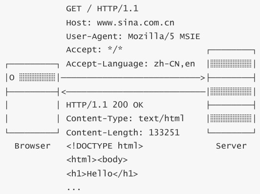
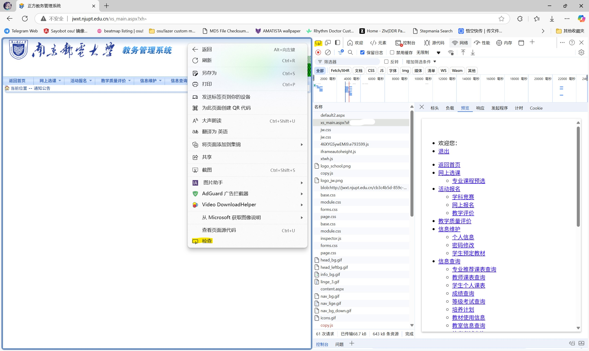

## 什么是爬虫

网络爬虫就是一种可以从网页上抓取数据信息并保存的自动化程序，它的原理就是模拟浏览器发送网络请求，接受请求响应，然后按照一定的规则自动抓取互联网数据。

这些程序几乎总是由搜索引擎操作。通过对爬网程序收集的数据执行搜索算法，搜索引擎可以响应用户搜索查询提供相关链接，在用户将搜索输入谷歌或 Bing（或其他搜索引擎）生成显示网页列表。

掌握爬虫技术就能使互联网的各种数据“为我所用”，因此在科研活动中也常用爬虫技术获取数据。

在开始学习爬虫之前，我们需要了解一些前置知识。

### TCP/IP

TCP/IP 泛指互联网协议，是为了解决计算机网络各自的通讯协议不统一而设立的规范。该协议被广泛应用在互联网中。

该协议中的一个重要组成部分是 IP。在互联网中，一个 IP 地址用于唯一标识一个*网络接口*（Network Interface）。连接到互联网的计算机都会被分配一个或多个 IP 地址。IP 地址有 IPv4 和 IPv6 两种版本，IPv4 采用 32 位地址，类似
`101.202.99.12`，而IPv6采用128位地址，类似 `2001:0DA8:100A:0000:0000:1020:F2F3:1428`。

### 域名、DNS

直接记忆 IP 地址来访问网站通常是非常困难的，因此我们通常使用域名（通常意义上的“网址”）来访问一个服务。此时就需要用 *DNS*（域名解析服务）将域名转化为对应的 IP 地址使计算机能够解析。

例如，我们可以通过 `nslookup` 命令查询百度官网的 IP 地址：

```text
> nslookup www.baidu.com
服务器:  UnKnown
Address:  10.22.240.10

非权威应答:
名称:    www.a.shifen.com
Addresses:  240e:e9:6002:15a:0:ff:b05c:1278
          240e:e9:6002:15c:0:ff:b015:146f
          180.101.50.188
          180.101.50.242
Aliases:  www.baidu.com
```

特殊地，用来标记本机自身的域名记为 `localhost`，对应的 IPv4 地址是 `127.0.0.1`，IPv6 地址是 `::1`。

### HTTP 协议

> 以下内容大部分参照 [MDN Web Docs](https://developer.mozilla.org/zh-CN/docs/Web/HTTP)。我个人非常推荐想学习 Web 相关知识的同学阅读此文档，其内容非常全面和规范。

*HTTP*（超文本传输协议，Hyper Text Transfer Protocol）是目前使用最广泛的 Web 应用程序使用的基础协议，它是 Web 上进行任何数据交换的基础，同时，也是一种客户端—服务器（client-server）协议，也就是说，请求是由接受方——通常是 Web 浏览器——发起的。完整网页文档通常由文本、布局描述、图片、视频、脚本等资源构成。

HTTP *请求*（Request）的格式是固定的，它由*请求头*（Header）和*请求体*（Body）两部分构成，下图展示一个典型的 HTTP 请求—响应过程：



在上例中，`GET` 表示请求方法，`/` 表示请求路径，`HTTP/1.1` 表示请求的 HTTP 版本。请求头一般会标出这些信息。

请求头是按键值对的格式组织信息的，即 `Header: Value` 形式，服务器依赖这些信息识别你的客户端请求。例如：

* `Host`：表示请求的域名，因为一台服务器上可能有多个网站，因此有必要依靠Host来识别请求是发给哪个网站的；
* `User-Agent`：表示客户端自身标识信息，不同的浏览器有不同的标识，服务器依靠 User-Agent 判断客户端类型（使用的浏览器）；
* `Accept`：表示客户端能处理的HTTP响应格式，`*/*` 表示任意格式，`text/*` 表示任意文本，`image/png` 表示 PNG 格式的图片；
* `Accept-Language`：表示客户端接收的语言，多种语言按优先级排序，服务器依靠该字段给用户返回特定语言的网页版本。

*若需要查看更多的请求头规范，参见[这里](https://developer.mozilla.org/zh-CN/docs/Web/HTTP/Headers)。*

请求方法表明要对给定资源执行的操作。在这里我们就提两个重要的：

* `GET`：请求一个指定资源的表示形式，使用 `GET` 的请求应该只被用于获取数据。
* `POST`：将实体提交到指定的资源，通常导致在服务器上的状态变化。

这两种请求方式最大的区别在于：`GET` 的请求体必须在 URL 中出现，`POST` 则不需要。因此，当我们做一个登录请求时，`GET` 方法会将你的用户名密码明文暴露在 URL 中，不是非常安全的选择；`POST` 则相对安全些。

*若需要查看更多的请求方法，参见[这里](https://developer.mozilla.org/zh-CN/docs/Web/HTTP/Methods)。*

服务器收到我们的请求后会进行回复，这称为 HTTP *响应*（Response），其也由响应头和响应体构成。回到上例，`HTTP/1.1` 表示版本、`200` 为响应代码、`OK` 为响应说明。HTTP 的响应代码是固定的，客户端依赖该代码判断响应的状态：

* `1xx`：表示一个提示性响应，例如 `101 Switching Protocol` 表示将切换协议，常见于 WebSocket 连接；
* `2xx`：表示一个成功的响应，例如 `200 OK` 表示成功，`206 Partial Content` 表示只发送了部分内容；
* `3xx`：表示一个重定向的响应，例如 `301 Moved Permanently` 表示永久重定向，`303 See Other` 表示客户端应该按指定路径重新发送请求；
* `4xx`：表示一个因为客户端问题导致的错误响应，例如 `400 Bad Request` 表示因为 Content-Type 等各种原因导致的无效请求，`404 Not Found` 表示指定的路径不存在；
* `5xx`：表示一个因为服务器问题导致的错误响应，例如 `500 Internal Seever Error` 表示服务器内部故障，`503 Service Unavailable` 表示服务器暂时无法响应。

*若需要查看更多的状态码规范，参见[这里](https://developer.mozilla.org/zh-CN/docs/Web/HTTP/Status)。*

### HTML

服务器发送给我们的资源页面使用 *HTML*（超文本标记语言，Hyper Text Markdown Language）。这个文件包含页面的文字内容，由浏览器渲染得到我们现在看到的网页，再配合 *CSS*（提供网页样式的文件）和 *JavaScript*（简称 JS，网页脚本，浏览器能运行它生成可互动的元素），就是现代网页的基本架构。

对于静态网页，我们希望爬取的内容一般来自 HTML 和网络请求中，因此其他的内容在此不作说明。

### 小结

我们再来看一下 HTTP 通信的完整过程：

域名解析 —> 与服务器建立连接 —> 发起 HTTP 请求 —> 【**服务器响应 HTTP 请求，浏览器得到 HTML —> 浏览器解析 HTML，并请求 HTML 中的资源（如 JS、CSS、图片）**】 —> 浏览器对页面进行渲染呈现给用户

实际上，除了直接在浏览器输入链接，点击按钮、点击视频链接等操作，都是在发送请求。而爬虫的任务就是抓取上述加粗部分/方括号部分中对我们有用的资源。

这些就是前置知识。事实上，想要完全理解爬虫，你需要学习更多，但现在这些知识对于之后的部分暂时足够了。

那么，让我们开始爬取网页吧。

## 浏览器开发者工具

在开始爬取网页之前，我们需要学会用浏览器开发者工具分析爬取的目标。通常打开开发者工具的快捷键是 `F12`。对于 Microsoft Edge，如果你关闭了该快捷键，你可以按下面的方式打开：


我们以[正方教务管理系统](http://jwxt.njupt.edu.cn/)为例，在该页填好用户名、密码和验证码，然后进入开发者工具，点击**网络**工具栏后，点击登录按钮，即可抓取登录时的网络活动。

**特别需要注意的是，在没有进入网络工具栏时，浏览器不会记录任何请求，所以请先打开工具栏再登录。**


> **提示**：若发现记录的请求在页面跳转后会消失，请勾选“**保留日志**”选项。

我们可以发现浏览器发送了一堆请求，**这些请求是按时间先后从上到下记录的**。上面提到过：**点击一下按钮就相当于发送一次请求**，因此登录的一瞬间出现的第一个请求即是我们要找的请求，即列表上的第一个（名称为 `default2.aspx`）。选中该请求：


其中可以看到上面提到的 HTTP 请求标头、响应请求标头的信息。可以看出这是一个 `POST` 请求，状态码为 `302 Found`，表示该请求被**重定向**。即：要求浏览器按照返回内容再发一次请求，也就是下方的 `xs_main.aspx?xh=Bxxxxxxxx`。

我们再看看“**负载**”，也就是**请求体**。可以看到这里面包含了刚刚填的学号，密码和验证码等信息，即可验证这就是我们要找的登录请求。再看到我们请求的 URL：`http://jwxt.njupt.edu.cn/default2.aspx`，从中看不到我们的登录信息，也说明了 `POST` 请求“相对安全”。


我们再看 `xs_main.aspx?xh=Bxxxxxxxx` 这条记录。该记录是一个 `GET` 请求，可以看到 URL 的后面出现了 `?xh=Bxxxxxxxx`，说明负载的信息出现在了 URL 中，验证了前面提到的知识。

我们再看看这两个请求的响应：第一个请求被重定向，因此没有内容；第二个请求返回了 HTML：


点击“**预览**”可以看到当前 HTML 渲染的页面：


可以发现这和我们实际看到的网页大相径庭，这是因为其他的资源（CSS、JS 等）都没有加载，这些资源的请求由浏览器解析 HTML 自动发出。这些资源加载完成后，浏览器加载完他们，才出现我们熟悉的页面。

你还可以在页面右击选择检查，或者点击开发者工具左上角的检查按钮，以查看每个元素对应的 HTML 部分。试着在页面中随便移动吧。



上述的所有操作称作为“**抓包**”。通过抓包抓取这些信息，然后在程序中模拟这些请求，就是爬虫主要干的一件事。前面说过，请求包含**请求头**和**请求体**两部分，为了完美的模仿一次请求，我们要尽量保证程序发送的请求头和请求体和浏览器发送的大致相同。

可能有人会疑惑：“*为什么我不完全照抄浏览器的请求？*”确实可以，而且大部分的爬虫项目都可以通过这个方法解决，但是总有一些网站不喜欢自己被机器人爬，因此加入了验证码、状态验证等，这些都会阻止你直接照抄，所以了解一些基础的网络知识是必要的。

那么现在，我们可以开始编程了。

## 使用 `requests` 爬取静态网页

我们就拿[校园网登录界面](https://p.njupt.edu.cn)试一试吧！

> **注意**：正在飞书线上听课的同学：请不要着急注销账号，否则会议会断开。你可以考虑用第二个设备参会，或是等我讲完了再继续操作。我会留足时间的。
>
> **注意**：这个程序**没有**自动连接网络的功能。请连接校园网后再发送请求，也不要断开校园网，直接断开并不会清除你的登录状态。

安装 `requests`。希望大家没有忘记装库的命令：

使用 `pip`：

```shell
pip install requests
```

使用 `conda`：

```shell
conda install requests
```

记住：我们的主要任务是**模仿一个登录请求**。因此我们需要抓包观察这个请求是如何进行的。


按照上面提到的方法，我们抓到这样的一个 `GET` 请求：

`https://p.njupt.edu.cn:802/eportal/portal/login?callback=dr1003&login_method=1&user_account=%2C0%2CBxxxxxxxx%40njxy&user_password=xxxxxxxx&wlan_user_ip=10.160.152.103&wlan_user_ipv6=&wlan_user_mac=000000000000&wlan_ac_ip=&wlan_ac_name=&jsVersion=4.1.3&terminal_type=1&lang=zh-cn&v=2068&lang=zh`

即这些字段：

```text
callback: dr1003
login_method: 1
user_account: ,0,Bxxxxxxxx
user_password: xxxxxxxx@njxy
wlan_user_ip: 10.160.152.103
wlan_user_ipv6: 
wlan_user_mac: 000000000000
wlan_ac_ip: 
wlan_ac_name: 
jsVersion: 4.1.3
terminal_type: 1
lang: zh-cn
v: 2068
lang: zh
```

事实上，经过不断尝试，只有这些字段是必要的：

```text
callback: dr1003
login_method: 1
user_account: ,0,Bxxxxxxxx
user_password: xxxxxxxx@njxy
```

我们直接看完整代码：

```python
import requests
import urllib
from urllib import parse

Bid = "Bxxxxxxxx"   # 学号
server = "cmcc"     # 服务（移动cmcc，电信njxy，校园网不填）
password = urllib.parse.quote("xxxxxxxx")    # 密码

url = ("https://p.njupt.edu.cn:802/eportal/portal/login?callback=dr1003&"
        "login_method=1&"
        "user_account=%2C0%2C{}%40{}&"
        "user_password={}&".format(Bid, server, password))
headers = {
    "User-Agent": "Mozilla/5.0 (Windows NT 10.0; Win64; x64) AppleWebKit/537.36 (KHTML, like Gecko) Chrome/118.0.0.0 Safari/537.36 Edg/118.0.2088.46",
    "Accept": "*/*"}
req = requests.get(url, headers=headers)

print(req.text)
```

### 代码解析

URL 部分很简单，由于要做的是 `GET` 请求，我们只需要把请求参数放到 URL 中即可。

请求头部分包含了一个 `User-Agent` 和 `Accept`（不重要）。改写 `User-Agent` 几乎是做爬虫必须的，因为 Python `requests` 库默认的 User-Agent 为 `python-requests/x.x.x`（`requests` 版本号），这相当于告诉服务器：

> 害害害！老子要用 `requests` 爬爬你的网站啦！让我康康……
>
> **提示**：作者此时已经连续写了两个半小时文档，他现在的神经很状态。（2024/12/07 22:00）

所以为了不让服务器在知道你要爬爬它的时候就把你拒之门外，你还是需要伪装成“正人君子”的。

```python
req = requests.get(url, headers=headers)
```

这里则是使用了 `requests` 库的 `get` 方法，参数 `url` `headers` 分别对应我们需要的 URL 和请求头。之后再通过 `print(req.text)` 输出请求结果。

整个过程就是通过 `requests` 发送登录的 `GET` 请求（包含我们的用户名密码等），然后验证通过，得到请求结果。

你还可以看看我一年前初次爬校园网时对这里的代码做的改进（渣库勿喷），里面有用 `pyinstaller` 打包的可执行版本以及命令行（`curl` 或 `Invoke-WebRequest`）登录的方法。[GitHub - WiIIiamWei/NJUPT-login](https://github.com/WiIIiamWei/NJUPT-login)

至此你便完成了你的第一个爬虫项目，祝贺你！

## 后记

这之后呢？我想成为爬虫大师，我应该学什么？

奈何这学年时间太紧，~~加上我们人都挺懒，~~ 今年的授课数量极少，以至于原本需要三节课介绍完的爬虫估计到这里就结束了（要没结束我再说点其他的！）。总之在这里补充一点爬虫常用的库，供大家自行搜索和学习吧。

* 你还没有学完 `requests` 里的所有内容。多练练吧！
* 和 `requests` 配套的另一个工具是 Beautiful Soup `bs4`。它可以对 HTML 进行解析，查找特定节点的内容等。
* 很多大网站（比如淘宝等购物网站）都是动态加载的网页，用 `requests` 什么都读不到，这时候就需要 `selenium` 出手了。`selenium` 是一个 Web 的自动化测试工具，最初是为网站自动化测试而开发，可以直接运行在浏览器上，可以控制浏览器发送请求，获取网页数据。**注意：为了能正常使用 `selenium`，你通常需要安装一个 WebDriver，请自行搜索安装教程。**
* 如果你是大佬，你还可以试试最新最热的 `playwright` 浏览器自动化测试工具……
